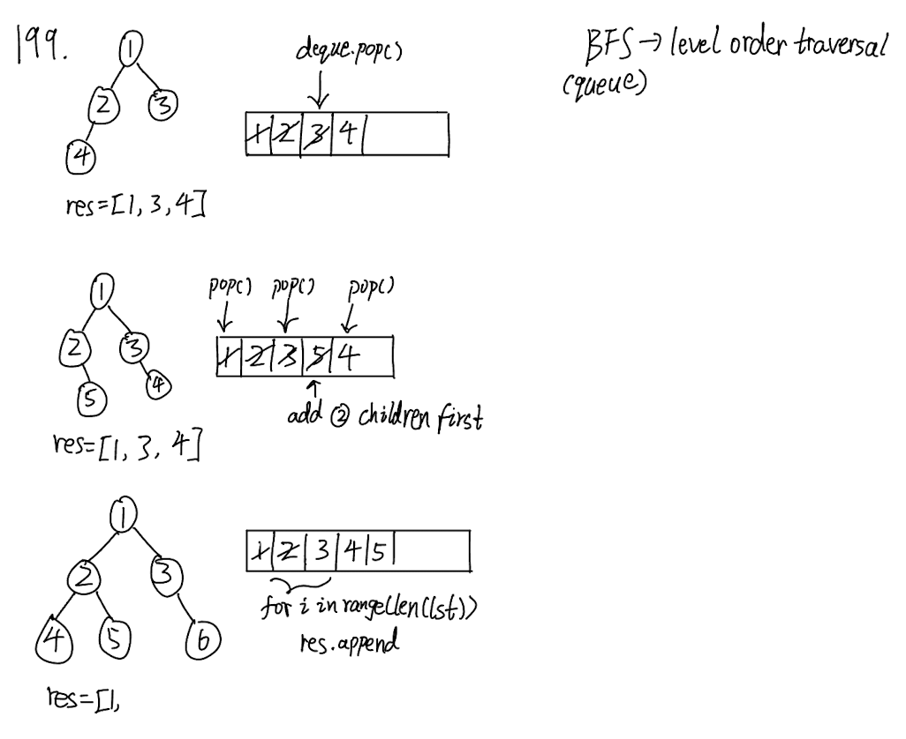
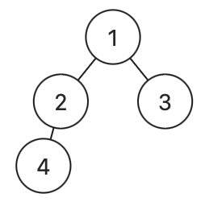

## 199. Binary Tree Right Side View (Medium)
**Date and Time:** Jun 7, 2024, 10:37 AM (EST)

Link: https://leetcode.com/problems/binary-tree-right-side-view/

<br>

### Question:
Given the `root` of a binary tree, imagine yourself standing on the **right side** of it, return _the values of the nodes you can see ordered from top to bottom_.

<br>

**Example 1:**


> **Input:** root = [1, 2, 3, null, 5, null, 4]
> 
> **Output:** [1, 3, 4]

**Example 2:**
> **Input:** root = [1, null, 3]
> 
> **Output:** [1, 3]

**Example 3:**
> **Input:** root = [ ]
> 
> **Output:** [ ]

<br>

### KeyPoints: 
Use `deque()` datastructure to support `pop(), append(), appendleft()` from the left and the right.



<br>

### Wrong answer:
It doesn't handle the case [1, 2, 3, 4] in level order, which should return `[1, 3, 4]` but this solution returns `[1 ,3]`. DFS in this case is not the best way, since we want to traverse in BFS.

 `Expected: [1, 3, 4], Actual: [1, 3]`

```python
class Solution:
    def rightSideView(self, root: Optional[TreeNode]) -> List[int]:
        # DFS with right side only
        res = []
        queue = [root]
        while queue:
            node = queue.pop()
            if node is not None:
                res.append(node.val)
                if node.right is None and node.left is not None:
                    queue.append(node.left)
                else:
                    queue.append(node.right)
        return res
```

<br>

### My Solution:
Look at **KeyPoints** for the screenshot of the steps I implemented. The point is we only add the last element of the previous queue into the `res`, this is why we get `nums` in the beginning. Then we repeatedly add `node.left` and `node.right` into the queue, notice that we add the left subtree before the right subtree.
```python
class Solution:
    def rightSideView(self, root: Optional[TreeNode]) -> List[int]:
        res = []
        deque = collections.deque([root])
        while deque:
            nums = len(deque)
            for i in range(nums):
                node = deque.pop()
                if node:
                    if node.left:
                        deque.appendleft(node.left)
                    if node.right:
                        deque.appendleft(node.right)
            if node:
                res.append(node.val)
        return res
```
<br>

### Refined Solution:
Notice the previous solution, I `pop()` the node by the last element, which is not what I initially wanted, to fix this mistake I append `node.left, node.right` by `appendleft()`. The most inituitive way should be:
```python
class Solution:
    def rightSideView(self, root: Optional[TreeNode]) -> List[int]:
        res = []
        deque = collections.deque([root])
        while deque:
            nums = len(deque)
            for i in range(nums):
                node = deque.popleft()
                if node:
                    if node.left:
                        deque.append(node.left)
                    if node.right:
                        deque.append(node.right)
            if node:
                res.append(node.val)
        return res
```
