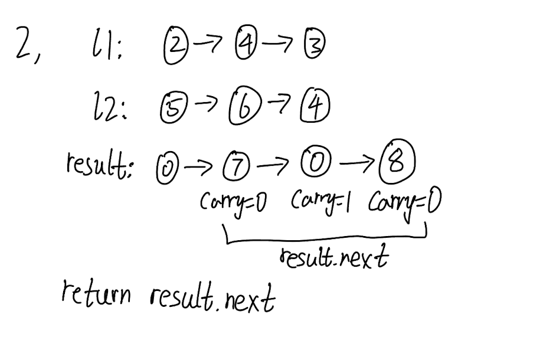

## 2. Add Two Numbers (Medium)

Link: https://leetcode.com/problems/add-two-numbers/

<br>

### Question:
You are given two **non-empty** linked lists representing two non-negative integers. The digits are stored in **reverse order**, and each of their nodes contains a single digit. Add the two numbers and return the sum as a linked list.

You may assume the two numbers do not contain any leading zero, except the number 0 itself.

<br>

**Example 1:**


> **Input:** l1 = [2,4,3], l2 = [5,6,4]
> 
> **Output:** [7,0,8]
>
> **Explanation:** 342 + 465 = 807.

**Example 2:**
> **Input:** l1 = [0], l2 = [0]
> 
> **Output:** [0]

**Example 3:**
> **Input:** l1 = [9,9,9,9,9,9,9], l2 = [9,9,9,9]
> 
> **Output:** [8,9,9,9,0,0,0,1]

<br>

### Confusion: 
I forgot to handle the case when one of the two lists reach the end of the list, which will be `None`, I should set x or y to be 0, which are the first two lines of code in the while loop.

<br>

### KeyPoints: 
First, we create a dummy head with 0, so we can add sum to the new linkedlist recursively. And finally, return the part of new linkedlist after dummy head 0.




<br>

### Wrong answer:
```
# Definition for singly-linked list.
# class ListNode:
#     def __init__(self, val=0, next=None):
#         self.val = val
#         self.next = next
class Solution:
    def addTwoNumbers(self, l1: Optional[ListNode], l2: Optional[ListNode]) -> Optional[ListNode]:

        l1_lst, l2_lst = [], []
        while l1 is not None:
            l1_lst.append(l1.val)
            l1 = l1.next
            
        while l2 is not None:
            l2_lst.append(l2.val)
            l2 = l2.next

        new_lst = []
        for x, y in zip(l1_lst, l2_lst):
            new_lst.append(x+y)

        for i in range(len(new_lst)):
            if new_lst[i] >= 10:
                new_lst[i] = new_lst[i] % 10
                if i + 1 > len(new_lst):
                    new_lst.append(1)
                else:
                    new_lst[i+1] = new_lst[i+1] + 1
```

<br>

### My Solution:
First, create a dummy head for the new linkedlist so that we can append the new sum.  
Then each time in the while loop, set x, y to be `l1.val`, `l2.val` or `0` when one list is shorter than the another one.  
Next, we update the `carry` based on the `sum` and append the new node of the `sum % 10`.
Lastly, check the edge case if the last sum leads to an additional slot in the new linkedlist, if so, we just add it to the next with `carry`.
```
# Definition for singly-linked list.
# class ListNode:
#     def __init__(self, val=0, next=None):
#         self.val = val
#         self.next = next
class Solution:
    def addTwoNumbers(self, l1: Optional[ListNode], l2: Optional[ListNode]) -> Optional[ListNode]:
        dummy_head = ListNode()  # Create a new LinkedList
        curr = dummy_head
        carry = 0
        
        while l1 is not None or l2 is not None:
            x = l1.val if l1 is not None else 0   # 0 if list is finished
            y = l2.val if l2 is not None else 0
            sum = x + y + carry
            carry = sum // 10   # Update carry for next two Nodes
            curr.next = ListNode(sum % 10)
            curr = curr.next
            # If we reach the end of the LinkedList (None), we don't advance
            if l1 is not None: l1 = l1.next
            if l2 is not None: l2 = l2.next

        # Final check, if carry > 0, add it to the end of the LinkedList
        if carry > 0:
            curr.next = ListNode(carry)

        # Only return the LinkedList after the initialized node (0)
        return dummy_head.next
```
