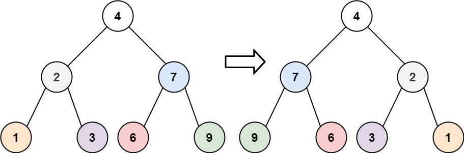

## 226. Invert Binary Tree (Easy)

Link: https://leetcode.com/problems/invert-binary-tree/

<br>

### Question: 
Given the `root` of a binary tree, invert the tree, and return _its root_.

<br>

**Example 1:**



> **Input:** root = [4, 2, 7, 1, 3, 6, 9]
> 
> **Output:** [4, 7, 2, 9, 6, 3, 1]

**Example 2:**


> **Input:** root = [2, 1, 3]
> 
> **Output:** [2, 3, 1]

**Example 3:**
> **Input:** root = [ ]
> 
> **Output:** [ ]

<br>

### KeyPoints: 
Recursion...

<br>

### My Solution:
```
# Definition for a binary tree node.
# class TreeNode:
#     def __init__(self, val=0, left=None, right=None):
#         self.val = val
#         self.left = left
#         self.right = right
class Solution:
    def invertTree(self, root: Optional[TreeNode]) -> Optional[TreeNode]:
        if root:
            root.left, root.right = self.invertTree(root.right), self.invertTree(root.left)
        return root
```
