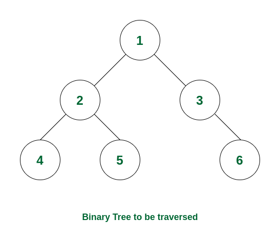

## 530. Minimum Absolute Difference in BST (Easy)
**Date and Time:** Jun 7, 2024, 10:21 PM (EST)

Link: https://leetcode.com/problems/minimum-absolute-difference-in-bst/

<br>

### Question:
Given the `root` of a Binary Search Tree (BST), return _the minimum absolute difference between the values of any two different nodes in the tree_.

<br>

**Example 1:**


> **Input:** root = [4, 2, 6, 1, 3]
> 
> **Output:** 1

**Example 2:**


> **Input:** root = [1, 0, 48, null, null, 12, 49]
> 
> **Output:** 1

<br>

### KeyPoints: 
This is the gif of how in-order traversal works.



<br>

### Wrong answer:
The solution is not correct because it does not get in touch with the `prev` node, which should be access in-order traversal.
```python
class Solution:
    def getMinimumDifference(self, root: Optional[TreeNode]) -> int:
        # Perform BFS, compare min and max to update the minimum
        deque = collections.deque([root])
        minimum = 0
        while deque:
            nums = len(deque)
            for i in range(nums):
                node = deque.popleft()
                if node:
                    if node.left:
                        minimum = min(minimum, abs(node.val - node.left.val))
                        deque.append(node.left)
                    if node.right:
                        minimum = min(minimum, abs(node.val - node.right.val))
                        deque.append(node.right)
        return minimum
```

<br>

### My Solution:
Just implement dfs, then compare current `min` and the two adjacent nodes in the tree. Notice that we need to `nonlocal prev, res` so the `dfs(node)` function can access the global variables `prev, res` each time.
```python
class Solution:
    def getMinimumDifference(self, root: Optional[TreeNode]) -> int:
        prev, res = None, float('inf')
        def dfs(node):
            if node is None:
                return
            dfs(node.left)
            nonlocal prev, res
            if prev:
                res = min(res, abs(prev.val - node.val))
            prev = node
            dfs(node.right)
        dfs(root)
        return res
```
