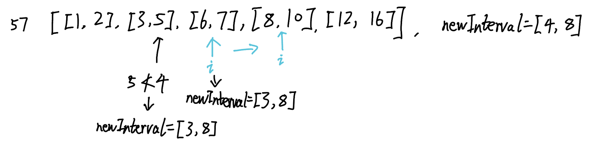

## 57. Insert Interval (Medium)
**Date and Time:** Jun 6, 2024, 6:17 PM (EST)

Link: https://leetcode.com/problems/insert-interval/

<br>

### Question:
You are given an array of non-overlapping intervals `intervals` where `intervals[i] = [start_i</sub>, end_i]` represent the start and the end of the `ith` interval and `intervals` is sorted in ascending order by `start_i`. You are also given an interval `newInterval = [start, end]` that represents the start and end of another interval.

Insert `newInterval` into `intervals` such that `intervals` is still sorted in ascending order by `start_i` and `intervals` still does not have any overlapping intervals (merge overlapping intervals if necessary).

Return `intervals` _after the insertion_.

**Note** that you don't need to modify `intervals` in-place. You can make a new array and return it.

<br>

**Example 1:**
> **Input:** intervals = [[1,3],[6,9]], newInterval = [2,5]
> 
> **Output:** [[1,5],[6,9]]

**Example 2:**
> **Input:** intervals = [[1,2],[3,5],[6,7],[8,10],[12,16]], newInterval = [4,8]
> 
> **Output:** [[1,2],[3,10],[12,16]]
>
> **Explanation:** Because the new interval [4,8] overlaps with [3,5],[6,7],[8,10].

<br>

### Confusion: 
While we are comparing intervals, it is one interval from intervals to compare with newInterval, e.g. [1, 2] vs [3,5], not a list of intervals to compare with newInterval: [[1, 2], [4, 5]] vs [3, 6]. So we should only consider the cases of one vs one, ie. the cases when lst[1] < newInterval[0] or newInterval[1] < lst[0].



<br>

### My Solution:
Think about the first two base cases: 
1. interval: [4, 8] < newInterval: [9, 11], we compare `interval[1]` and `newInterval[0]`, the `interval` is before `newInterval`, so we add the interval to our created list.
2. interval: [5, 6] > newInterval: [3, 4], we compare `inverval[0]` and `newInterval[1]`, the `newInterval` is before `interval`, so we add the newInterval to the list and append all the rest intervals `intervals[i:]` to the created list because the `newInterval` has already added to list, and since the `intervals` is in ascending order, so we can just append the rest `intervals` and return.

If the condtions are not these two base cases, then it is the case when overlap happens. To handle the overlap, we can just iteratively update the `newInterval` by updating `min` between `newInterval[0]` and `interval[0]`, `max` between `newInterval[1]` and `interval[1]`. When the `newInterval` has no more overlap, it has to satisfy the two base cases and return. If not, this is the last case when we only need to add the `newInterval` to the end of the created list: 

`intervals = [[1, 2], [3, 4]], newInterval = [5, 6]` or `intervals = [], newInterval = [5, 7]`

So we just append `newInterval` to the created list after the for loop ends.
```python
class Solution:
    def insert(self, intervals: List[List[int]], newInterval: List[int]) -> List[List[int]]:
        newLst = []
        for i in range(len(intervals)):
            # interval = [1, 2], newInterval = [3, 5], 2 < 3
            if intervals[i][1] < newInterval[0]:
                newLst.append(intervals[i])
            # interval = [6, 8], newInterval = [3, 5], 5 < 6
            elif newInterval[1] < intervals[i][0]:
                newLst.append(newInterval)
                return newLst + intervals[i:]
            else:   # Else case when overlapping happen
                newInterval = [min(intervals[i][0], newInterval[0]), max(intervals[i][1], newInterval[1])]
        # When newInterval should be added to the end of newLst or intervals = []
        newLst.append(newInterval)
        return newLst
```
<br>
