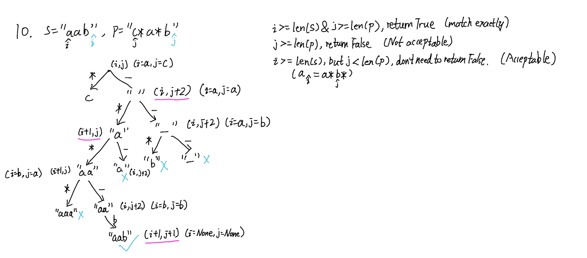

## 10. Regular Expression Matching (Hard)
**Date and Time:** Jun 27, 2024, 11:34 (EST)

Link: https://leetcode.com/problems/regular-expression-matching/

<br>

### Question:
Given an input string `s` and a pattern `p`, implement regular expression matching with support for `'.'` and `'*'` where:

- `'.'` Matches any single character.​​​​

- `'*'` Matches zero or more of the preceding element.

The matching should cover the **entire** input string (not partial).

<br>

**Example 1:**
> **Input:** s = "aa", p = "a"
> 
> **Output:** false
>
> **Explanation:** "a" does not match the entire string "aa".

**Example 2:**
> **Input:** s = "aa", p = "a*"
> 
> **Output:** true
>
> **Explanation:** '*' means zero or more of the preceding element, 'a'. Therefore, by repeating 'a' once, it becomes "aa".

**Example 3:**
> **Input:** s = "ab", p = ".*"
> 
> **Output:** true
>
> **Explanation:** ".*" means "zero or more (*) of any character (.)".

<br>

### KeyPoints: 
**First Solution**
1. We first check base cases: <br> i. If `i, j` in `s` and `p` are both out of bound, return True since they are finished. <br> ii. If only `j` in `p` is out of bound, but `i` in `s` still not finished, we should return False.

2. We then check `match` by checking if `i` of `s` in bound and either `s[i] == p[j]` or `p[j] == '.'`. 

3. We check if the next element `j+1` in `p` is `*`, we first check if `j + 1` in bound and if `p[j+1] == '*'`. If yes, we check two cases: <br> i. `match == True` then we move to next element `i+1` in `s`. <br> ii. `match == False`, which means current `p[j]` doesn't equal to `s[i]`, so we skip two elements `dfs(i, j+2)` to skip the current `p[j]` and the `*` sign.

4. If `p[j+1]` is not `*`, but we have a `match`, we can just proceed normally by `dfs(i+1, j+1)`.

5. We return `False` for any other cases of no match.

<br>

**DP solution**

In the solution, we first check two stopping conditions, which are the cases if `i, j` are both out of bound that means `s, p` are matched; if `p` is out of bound but `s` is not, we should return False.

Then, we step into the case to capture if `s, p` are matched or not by checking `i < len(s) and (s[i] == p[j] or p[j] == '.')`. Next, we consider the case when `p` has `'*'` and we check the two cases if we use the `'*'` or not, if we use it, we need to check `match and dfs(i+1, j)`, else `dfs(i, j+2)`. Once we use the `'*'` and there is a match, we can forward the `i` ptr by 1, otherwise we don't use it and move the `j` ptr to the next non`'*'` character. If `p` doesn't contain `'*'`, we check `match`, if there is a match, we forward both `i, j` ptr. Otherwise, we return False since there is no matching.

The dP version just adds a cache, we cache each checking conditions above into the `cache[i, j]`, and everytime we runt the `dfs()` we can check if the result is in `cache` already or not.

<br>




<br>

### My Solution:
```python
class Solution:
    def isMatch(self, s: str, p: str) -> bool:
        
        def dfs(i, j):
            # Both matches
            if i >= len(s) and j >= len(p):
                return True
            # p is out of bound, but s is not
            if i < len(s) and j >= len(p):
                return False
            # When i is in bound, s='a', (p='a' or p='.')
            match = i < len(s) and (s[i] == p[j] or p[j] == '.')
            # Case of '*', use it or not
            if (j + 1) < len(p) and p[j + 1] == '*':
                # If matches then we move i to the next, keep j the same
                # Otherwise, we move j to the next element (non '*')
                return (match and dfs(i+1, j)) or dfs(i, j+2)
            # If p doesn't have '*'
            if match:
                return dfs(i+1, j+1)
            return False
            
        return dfs(0, 0)
```

<br>

### Optimized dP version:
```python
class Solution:
    def isMatch(self, s: str, p: str) -> bool:
        dP = {}
        def dfs(i, j):
            # Check if in dP
            if (i, j) in dP:
                return dP[(i, j)]
            # Check stopping condtions
            # Both matches
            if i >= len(s) and j >= len(p):
                return True
            # p is out of bound, but s is not
            if i < len(s) and j >= len(p):
                return False

            # When i is in bound, [s='a', (p='a' or p='.')]
            match = i < len(s) and (s[i] == p[j] or p[j] == '.')
            # Case when p[j] == '*' and we use it or not
            if (j + 1) < len(p) and p[j + 1] == '*':
                # If there is a match we can proceed with dfs(i+1, j), [s='a', p='a*']
                dP[(i, j)] = (match and dfs(i+1, j)) or dfs(i, j+2)
                return dP[(i, j)]
            # Case when p does not contain '*'
            if match:
                dP[(i ,j)] = dfs(i+1, j+1)
                return dP[(i ,j)]
            # Case when none of the above cases happen
            dP[(i ,j)] = False
            return dP[(i ,j)]

        return dfs(0, 0)
```
**Time Complexity:** $O(n^2)$ where $n$ is the length of `s`. <br>
**Space Complexity:** $O(n^2)$, the worst case scenario we cache every combination of [i, j], when there are `n` of `i` and `n` of `j`.

<br>

