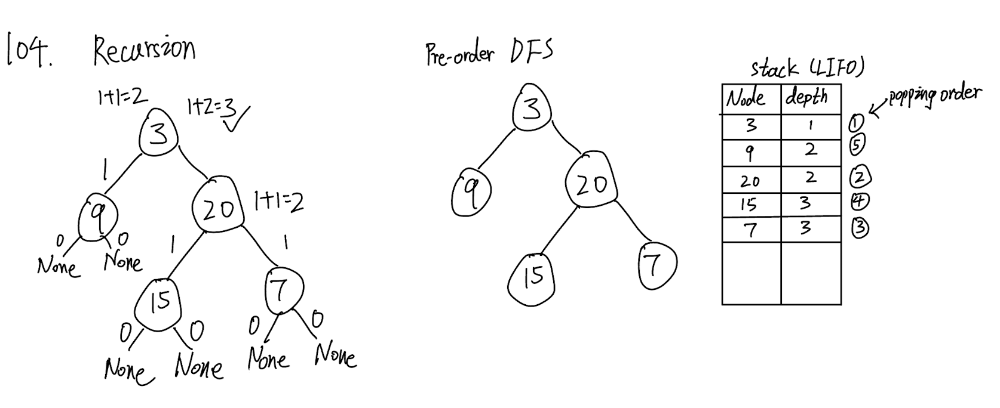

## 104. Maximum Depth of Binary Tree (Easy)
**Date and Time:** May 28, 2024 (EST) <br>

Link: https://leetcode.com/problems/maximum-depth-of-binary-tree/

<br>

### Question:
Given the `root` of a binary tree, return its maximum depth.

A binary tree's **maximum depth** is the number of nodes along the longest path from the root node down to the farthest leaf node.

<br>

**Example 1:**


> **Input:** root = [3, 9, 20, null, null, 15, 7]
>
> **Output:** 3

**Example 2:**
> **Input:** root = [1, null, 2]
>
> **Output:** 2

<br>

### KeyPoints:
For recursion version solution, we find the base case as when `root is None` and we should return 0,then for each level, we find the max depth by `max(left, right)`, add 1 to the current level, and return to the previous level.

For the alternative solution (DFS), we use `stack` to store `[root, 1]` first,  then  while `stack` is not empty, we `pop()` the element from the `stack` with its `depth`, we then check if the `node` we pop from stack is not None, we can append `[node.left, depth+1], [node.right, depth+1]` to `stack`, and we repeat this process for DFS.



<br>

### BFS
Apr 28, 2026 23:10, [ Time taken: 8m 37s ]
```python
# Definition for a binary tree node.
# class TreeNode:
#     def __init__(self, val=0, left=None, right=None):
#         self.val = val
#         self.left = left
#         self.right = right
class Solution:
    def maxDepth(self, root: Optional[TreeNode]) -> int:
        # BFS
        # queue[] FIFO to explore each level and after finished
        # Increment depth for new level
        # TC: O(n), SC: O(n)
        if not root:
            return 0
        deque = collections.deque([[root, 1]])
        while deque:
            # Keep exploring within current len(deque)
            for _ in range(len(deque)):
                node, depth = deque.popleft()
                # Explore node's left and right with depth + 1
                if node.left:
                    deque.append([node.left, depth + 1])
                if node.right:
                    deque.append([node.right, depth + 1])
        return depth
```

<br>

### Recursive Solution
Apr 28, 2026 21:52, [ Time taken: 9m 27s ]
```python
# Definition for a binary tree node.
# class TreeNode:
#     def __init__(self, val=0, left=None, right=None):
#         self.val = val
#         self.left = left
#         self.right = right
class Solution:
    def maxDepth(self, root: Optional[TreeNode]) -> int:
        # Return from the leaf node, then +1 for each level
        # We only take the max(left, right) + 1 to avoid overcounting, because we only care the deepest subtree
        # TC: O(n), n=total nodes, SC: O(1)
        if not root:
            return 0
        # Pick the deepest subtree + this level to return to the higher level
        return max(self.maxDepth(root.left), self.maxDepth(root.right)) + 1
```

<br>

### DFS Solution:
```python
# Definition for a binary tree node.
# class TreeNode:
#     def __init__(self, val=0, left=None, right=None):
#         self.val = val
#         self.left = left
#         self.right = right
class Solution:
    def maxDepth(self, root: Optional[TreeNode]) -> int:
        # Pre-order DFS
        stack = [[root, 1]]   # Start with the root node, depth 1
        result = 0
        while stack:
            root, depth = stack.pop()
            # Check if root node is not null
            if root:
                result = max(result, depth)
                stack.append([root.left, depth + 1])    # Add left node to stack
                stack.append([root.right, depth + 1])   # Add right node to stack
        return result
```
**Time Complexity:** $O(n)$, `n` is the total nodes. <br>
**Space Complexity:** $O(n)$

<br>


