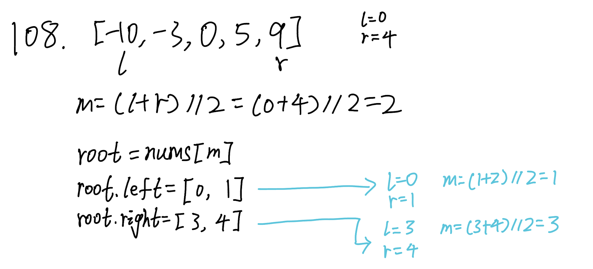

## 108. Convert Sorted Array to Binary Search Tree (Easy)
**Date and Time:** Jun 23, 2024, 22:00 (EST)

Link: https://leetcode.com/problems/convert-sorted-array-to-binary-search-tree/

<br>

### Question:
Given an integer array `nums` where the elements are sorted in **ascending order**, convert _it to a height-balanced binary search tree_.

<br>

**Example 1:**


> **Input:** nums = [-10, -3, 0, 5, 9]
>
> **Output:** [0, -3, 9, -10, null, 5]
>
> **Explanation:** [0, -10, 5, null, -3, null, 9] is also accepted:


**Example 2:**


> **Input:** nums = [1, 3]
> 
> **Output:** [3, 1]
>
> **Explanation:** [1, null, 3] and [3, 1] are both height-balanced BSTs.

<br>

### KeyPoints: 
We first find the mid point of the whole array as the root, then we recursively go to the left subtree and right subtree and find its mid point of each subtree.



<br>

### My Solution:
```python
# Definition for a binary tree node.
# class TreeNode:
#     def __init__(self, val=0, left=None, right=None):
#         self.val = val
#         self.left = left
#         self.right = right
class Solution:
    def sortedArrayToBST(self, nums: List[int]) -> Optional[TreeNode]:
        def convert(l, r):
            # Base case: when L > R, we return
            if l > r:
                return
            m = (l + r) // 2
            # Create parent node of left subtree and right subtree
            root = TreeNode(nums[m])
            root.left = convert(l, m - 1)
            root.right = convert(m+1, r)
            return root
        return convert(0, len(nums)-1)
```

<br>

