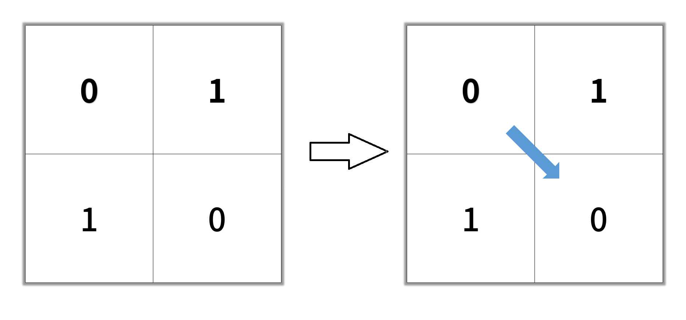
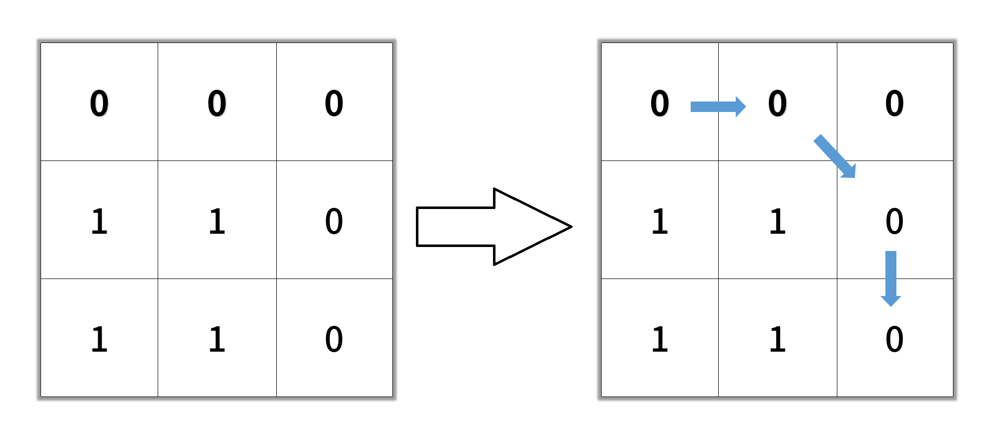

## 1091. Shortest Path in Binary Matrix (Medium)
**Date and Time:** Dec 5, 2024, 11:00 (EST)

Link: https://leetcode.com/problems/shortest-path-in-binary-matrix

<br>

### Question:
Given an `n x n` binary matrix `grid`, return the length of the shortest **clear path** in the matrix. If there is no clear path, return `-1`.

A **clear path** in a binary matrix is a path from the **top-left** cell (i.e., `(0, 0)`) to the **bottom-right** cell (i.e., `(n - 1, n - 1)`) such that:

* All the visited cells of the path are `0`.

* All the adjacent cells of the path are **8-directionally** connected (i.e., they are different and they share an edge or a corner).

The **length of a clear path** is the number of visited cells of this path.

<br>

**Example 1:**



> **Input:** grid = [[0,1],[1,0]]
> 
> **Output:** 2

**Example 2:**



> **Input:** grid = [[0,0,0],[1,1,0],[1,1,0]]
> 
> **Output:** 4

**Example 3:**
> **Input:** grid = [[1,0,0],[1,1,0],[1,1,0]]
> 
> **Output:** -1

<br>

#### Constraints:
* `n == grid.length`

* `n == grid[i].length`

* `1 <= n <= 100`

* `grid[i][j] is 0 or 1`

<br>

### Walk-through: 
We can first check if top-left and bottom-right is not `1` (reachable). If not, we can return `-1` right away.

Use `deque[]` to save neighbors, and `visited()` to mark all the visited cells. Then, we run BFS to find the shortest path. We need to restrict each time we only check the neighbors in `deque[]` in the same level. So we only update `res += 1` after we traverse all the same level neighbors.

If we find a cell is the bottom-right, we return `res`. Otherwise, if the deque is empty, we return `-1` since we can't reach the bottom-right cell.

<br>

### Python Solution:
Jun 11, 2026, [Time Taken, 22m 21s]

Run BFS with `[pos, steps]`.

Remember to add `(r, c)` into `visited()` when enqueue, not dequeue.
```python
class Solution:
    def shortestPathBinaryMatrix(self, grid: List[List[int]]) -> int:
        # Q: Return the shortest path from top-left to bottom-right
        # S: Base case: check if top-left != 1
        # 1. Run BFS from top left only if top left is not 1
        # 2. Use deque with [(r, c), steps]
        # 3. Update res when we reach the bottom-right
        # TC: O(n^2), SC: O(n^2)

        # 1. Check base case
        if grid[0][0] == 1:
            return -1
        # 2. Run BFS
        deque = collections.deque([[(0, 0), 1]])   # [pos, steps]
        visited = set()
        visited.add((0, 0))
        res = inf
        directions = [[-1, 0], [1, 0], [0, 1], [0, -1], [1, 1], [1, -1], [-1, -1], [-1, 1]]
        while deque:
            for _ in range(len(deque)):
                pos, steps = deque.popleft()
                r, c = pos
                # Check if (r, c) in bottom-right
                if r == (len(grid) - 1) and c == (len(grid[0]) - 1):
                    res = min(res, steps)
                for dr, dc in directions:
                    newR, newC = r+dr, c+dc
                    # Check in bound and new pos is 0
                    if newR in range(len(grid)) and newC in range(len(grid[0])) and grid[newR][newC] == 0 and (newR, newC) not in visited:
                        deque.append([(newR, newC), steps + 1])
                        visited.add((newR, newC))
        return res if res != inf else -1
```
**Time Complexity:** $O(n^2)$ <br>
**Space Complexity:** $O(n^2)$

<br>

