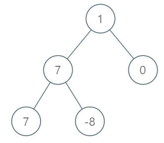

## 1161. Maximum Level Sum of a Binary Tree (Medium)
**Date and Time:** Oct 18, 2024, 15:50 (EST)

Link: https://leetcode.com/problems/maximum-level-sum-of-a-binary-tree/

<br>

### Question:
Given the `root` of a binary tree, the level of its root is `1`, the level of its children is `2`, and so on.

Return the **smallest** level `x` such that the sum of all the values of nodes at level `x` is **maximal**.

<br>

**Example 1:**



> **Input:** root = [1,7,0,7,-8,null,null]
> 
> **Output:** 2
>
> **Explanation:** <br>
> Level 1 sum = 1. <br>
> Level 2 sum = 7 + 0 = 7. <br>
> Level 3 sum = 7 + -8 = -1. <br>
> So we return the level with the maximum sum which is level 2.

**Example 2:**
> **Input:** root = [989,null,10250,98693,-89388,null,null,null,-32127]
> 
> **Output:** 2

<br>

#### Constraints:
* The number of nodes in the tree is in the range `[1, 10^4]`.

* `-10^5 <= Node.val <= 10^5`

<br>

### Walk-through: 
Run BFS to save each level's nodes into `deque[]`, and we initialize a `tmp_sum` to keep track of this level's nodes' sum, and we compare with current `res` to decide whether we should update `res` and `level` or not. The way to implement BFS on Binary Tree is very similar to [199. Binary Tree Right Side View](./questions/199.Binary_Tree_Right_Side_View_(Medium).md).

<br>

### Python Solution:
```python
# Definition for a binary tree node.
# class TreeNode:
#     def __init__(self, val=0, left=None, right=None):
#         self.val = val
#         self.left = left
#         self.right = right
class Solution:
    def maxLevelSum(self, root: Optional[TreeNode]) -> int:
        # For each level x, which level has the max sum
        # level, res, update res and level at the same time
        # Run BFS on each level and append nodes into stack

        # TC: O(n), SC: O(n)
        deque = collections.deque()
        level, res = 1, root.val
        deque.append([level, root])
        while deque:
            tmp_sum = 0
            for _ in range(len(deque)):
                h, node = deque.popleft()
                if node:
                    if node.left:
                        deque.append([h+1, node.left])
                    if node.right:
                        deque.append([h+1, node.right])
                tmp_sum += node.val

            # Update res and level if tmp_sum > res
            if tmp_sum > res:
                res = tmp_sum
                level = h

        return level
```
**Time Complexity:** $O(n)$ <br>
**Space Complexity:** $O(n)$

<br>

