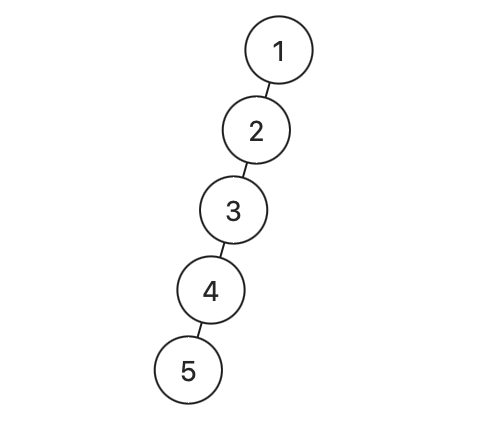

## 124. Binary Tree Maximum Path Sum (Hard)
**Date and Time:** Jul 18, 2024, 18:34 (EST)

Link: https://leetcode.com/problems/binary-tree-maximum-path-sum/

<br>

### Question:
A **path** in a binary tree is a sequence of nodes where each pair of adjacent nodes in the sequence has an edge connecting them. A node can only appear in the sequence **at most once**. Note that the path does not need to pass through the root.

The **path sum** of a path is the sum of the node's values in the path.

Given the `root` of a binary tree, return _the maximum **path sum** of any **non-empty** path_.

<br>

**Example 1:**


> **Input:** root = [1,2,3]
> 
> **Output:** 6
>
> **Explanation:** The optimal path is 2 -> 1 -> 3 with a path sum of 2 + 1 + 3 = 6.

**Example 2:**


> **Input:** root = [-10,9,20,null,null,15,7]
> 
> **Output:** 42
>
> **Explanation:** The optimal path is 15 -> 20 -> 7 with a path sum of 15 + 20 + 7 = 42.

**Edge case:**



> **Input:** root = [1,2,null,3,null,4,null,5]
>
> **Output:** 15
>
> **Explanation:** Taking the left tree path sum.

<br>

#### Constraints:
* The number of nodes in the tree is in the range `[1, 3 * 10^4]`.

* `-1000 <= Node.val <= 1000`

<br>

### KeyPoints: 
We use `list[]` for `res` because `list[]` is mutable in-place, but `interger` is immutable in-place. Then in the `dfs()` we want to compare `res[0]` and `root.val + left + right`, so we update `res[0]`. And for the `dfs` base case for return, we want `root.val + max(left, right)` that is the result we get on `dfs(root.left), dfs(root.right)`. To prevent getting negative value, we ensure `left = max(left, 0)` same for `right`.

We return `root.val + max(left, right)` for the **edge case** above. If we only return `root.val` it won't work for the edge case.

<br>

### My Solution:
```python
# Definition for a binary tree node.
# class TreeNode:
#     def __init__(self, val=0, left=None, right=None):
#         self.val = val
#         self.left = left
#         self.right = right
class Solution:
    def maxPathSum(self, root: Optional[TreeNode]) -> int:
        # Each node stores max(node.val, node.val + prev, 0)
        res = [root.val]
        def dfs(root):
            if not root:
                return 0
            left = dfs(root.left)
            right = dfs(root.right)
            left = max(left, 0)
            right = max(right, 0)
            res[0] = max(res[0], root.val + left + right)
            return root.val + max(left, right)
        dfs(root)
        return res[0]
```
**Time Complexity:** $O(n)$ <br>
**Space Complexity:** $O(1)$

<br>

