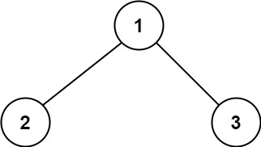
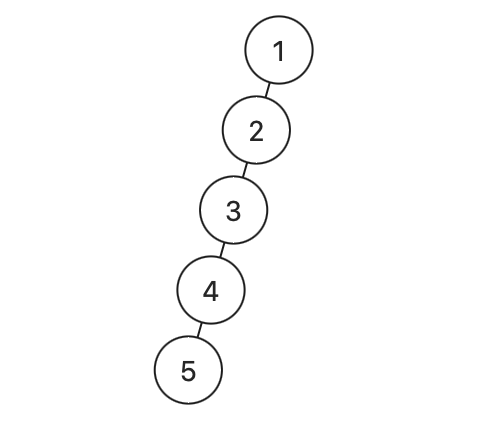

## 124. Binary Tree Maximum Path Sum (Hard)
**Date and Time:** Jul 18, 2024, 18:34 (EST)

Link: https://leetcode.com/problems/binary-tree-maximum-path-sum/

<br>

### Question:
A **path** in a binary tree is a sequence of nodes where each pair of adjacent nodes in the sequence has an edge connecting them. A node can only appear in the sequence **at most once**. Note that the path does not need to pass through the root.

The **path sum** of a path is the sum of the node's values in the path.

Given the `root` of a binary tree, return _the maximum **path sum** of any **non-empty** path_.

<br>

**Example 1:**



> **Input:** root = [1,2,3]
> 
> **Output:** 6
>
> **Explanation:** The optimal path is 2 -> 1 -> 3 with a path sum of 2 + 1 + 3 = 6.

**Example 2:**


> **Input:** root = [-10,9,20,null,null,15,7]
> 
> **Output:** 42
>
> **Explanation:** The optimal path is 15 -> 20 -> 7 with a path sum of 15 + 20 + 7 = 42.

**Edge case:**



> **Input:** root = [1,2,null,3,null,4,null,5]
>
> **Output:** 15
>
> **Explanation:** Taking the left tree path sum.

<br>

#### Constraints:
* The number of nodes in the tree is in the range `[1, 3 * 10^4]`.

* `-1000 <= Node.val <= 1000`

<br>

### Walk-through


<br>

### Solution
```python
# Definition for a binary tree node.
# class TreeNode:
#     def __init__(self, val=0, left=None, right=None):
#         self.val = val
#         self.left = left
#         self.right = right
class Solution:
    def maxPathSum(self, root: Optional[TreeNode]) -> int:
        # Q: Return the max path sum
        # S: Run DFS from to leaf, then recurse back to update each subtree's sum to update res, then we return the value by node.val + max(left, right) back to parent node, because a valid path sum from parent to its children, can only take either node and left or right child
        # DFS + Kadane's Algo
        # TC: O(n), n is total nodes, SC: O(log H)

        res = -inf
        def dfs(node):
            nonlocal res
            if not node:
                return 0
            # In case of negative number, rather take only one node instead of multiple nodes, which leads to smaller sum
            left = max(dfs(node.left), 0)
            right = max(dfs(node.right), 0)
            # Update res in each subtree/level
            res = max(res, node.val + left + right)
            # Return either left + node or right + node or node as parent return value
            return node.val + max(left, right)
        dfs(root)
        return res
```
**Time Complexity:** $O(n)$ <br>
**Space Complexity:** $O(1)$

<br>

