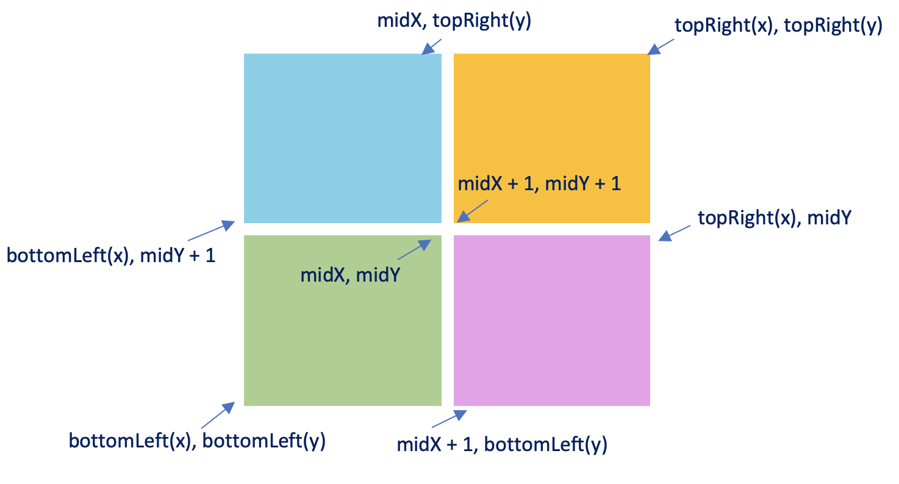

## 1274. Number of Ships in a Rectangle (Hard)
**Date and Time:** Jun 12, 2026

Link: https://leetcode.com/problems/number-of-ships-in-a-rectangle/

<br>

### Question:
_(This is an **interactive problem**.)_

Each ship is located at an integer point on the sea represented by a cartesian plane. You can call the API `Sea.hasShips(topRight, bottomLeft)` which returns `true` if there is at least one ship in the rectangle represented by the two points, including on the boundary. Otherwise, it returns `false`.

Given two points `topRight` and `bottomLeft`, return the number of ships present in that rectangle. It is guaranteed that there are **at most 10 ships** in that rectangle. Submissions making **more than 400 calls** to `hasShips` will be judged as _Wrong Answer_. Also, any solutions that attempt to invade or alter the sea are **prohibited**.

<br>

**Example 1:**
> **Input:** ships = [[1,1],[2,2],[3,3],[5,5]], topRight = [4,4], bottomLeft = [0,0] <br>
> **Output:** 3 <br>
> **Explanation:** From [0,0] to [4,4] we can count 3 ships within the range.

**Example 2:**
> **Input:** ans = 0, topRight = [1,1], bottomLeft = [0,0] <br>
> **Output:** 0

<br>

#### Constraints:
* On each call to `hasShips`, `0 <= bottomLeft.x <= topRight.x <= 1000` and `0 <= bottomLeft.y <= topRight.y <= 1000`.

* At most 400 calls can be made to `hasShips`.

<br>

### Walk-through:
Use **divide and conquer**: split the current rectangle into 4 quadrants at the midpoint, recursively count ships in each.

**Base cases:**
1. If `bottomLeft.x > topRight.x` or `bottomLeft.y > topRight.y` → out of bounds, return `0`.
2. If `sea.hasShips(topRight, bottomLeft)` is `False` → no ships here, return `0`.
3. If `topRight == bottomLeft` (single point) and `hasShips` is `True` → return `1`.

**Divide:** compute `midX, midY` and recurse into:
- **TL**: `(Point(midX, topRight.y), Point(bottomLeft.x, midY+1))`
- **TR**: `(topRight, Point(midX+1, midY+1))`
- **BL**: `(midPt, bottomLeft)`
- **BR**: `(Point(topRight.x, midY), Point(midX+1, bottomLeft.y))`

**Complexity argument:** at most 10 ships; each ship causes at most `4 * log₂(1000) ≈ 40` calls, so total ≤ ~400 calls.

<center>

</center>

<br>

### Python Solution:
```python
class Solution:
    def countShips(self, sea: 'Sea', topRight: 'Point', bottomLeft: 'Point') -> int:
        # Q: Return the # ships within range of topRight and bottomLeft
        # S: By using divide and conquer, we can find the base case, if given an area tR and bL we can find it, we will find the pt until tR == bL. Otherwise, we should get return 0 when hasShips(tR, bL) == False

        # Proof: for each ship, each level we split by 4, so we take log_4 1,000,000 roughtly 10, and each level we make at most 4 calls, so for 10 ships, the total calls will be 10 * 4 * 10 = 400

        # TC: O(S * log_2 max(M, N)), M is for range of x, N is range of y, S is total ships, SC: O(log_2 max(M, N)), recursion call stack depth

        # Base case, check they are in-bound
        if bottomLeft.x > topRight.x or bottomLeft.y > topRight.y:
            return 0
        # Base case 1: when there is no ship within this rectangle
        if not sea.hasShips(topRight, bottomLeft):
            return 0
        # Base case 2: when there is a ship, two points coordinates are the same
        if topRight.x == bottomLeft.x and topRight.y == bottomLeft.y:
            return 1
        # Divide 4 rectangles from mid point
        midX, midY = (topRight.x + bottomLeft.x) // 2, (topRight.y + bottomLeft.y) // 2
        midPt = Point(midX, midY)
        # Apply divide and conquer in 4 quadrants
        # 1st: [(midPt.x, topRight.y), (midPt.x, midPt.y+1)]
        # 2nd: [(topRight), (midtPt.x+1, midPt.y+1)]
        # 3rd: [(bottomLeft), (midPt)]
        # 4th: [(topRight.x, midPt.y), (midPt.x+1, bottomLeft.y)]
        return (
            self.countShips(sea, Point(midPt.x, topRight.y),   Point(bottomLeft.x, midPt.y+1)) + # TL
            self.countShips(sea, topRight,                      Point(midPt.x+1, midPt.y+1))    + # TR
            self.countShips(sea, midPt,                         bottomLeft)                      + # BL
            self.countShips(sea, Point(topRight.x, midPt.y),    Point(midPt.x+1, bottomLeft.y))   # BR
        )
```
**Time Complexity:** $O(S \cdot \log_2 \max(M, N))$, `S` = number of ships, `M, N` = coordinate ranges; each ship is isolated in $O(\log_2 \max(M, N))$ levels with at most 4 calls per level. <br>
**Space Complexity:** $O(\log_2 \max(M, N))$, for the recursion call stack depth.

<br>


