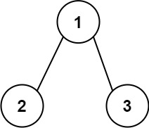

## 129. Sum Root to Leaf Numbers (Medium)
**Date and Time:** Dec 12, 2024, 11:06 (EST)

Link: https://leetcode.com/problems/sum-root-to-leaf-numbers

<br>

### Question:
You are given the `root` of a binary tree containing digits from `0` to `9` only.

Each root-to-leaf path in the tree represents a number.

* For example, the root-to-leaf path `1 -> 2 -> 3` represents the number `123`.

Return the total sum of all root-to-leaf numbers. Test cases are generated so that the answer will fit in a **32-bit** integer.

A **leaf** node is a node with no children.

<br>

**Example 1:**



> **Input:** root = [1,2,3]
> 
> **Output:** 25
>
> **Explanation:** <br>
> The root-to-leaf path `1->2` represents the number `12`. <br>
> The root-to-leaf path `1->3` represents the number `13`. <br>
> Therefore, sum = 12 + 13 = `25`.

**Example 2:**


> **Input:** root = [4,9,0,5,1]
> 
> **Output:** 1026
>
> **Explanation:** <br>
> The root-to-leaf path `4->9->5` represents the number `495`. <br>
> The root-to-leaf path `4->9->1` represents the number `491`. <br>
> The root-to-leaf path `4->0` represents the number `40`. <br>
> Therefore, sum = 495 + 491 + 40 = `1026`.

<br>

#### Constraints:
* The number of nodes in the tree is in the range `[1, 1000]`.

* `0 <= Node.val <= 9`

* The depth of the tree will not exceed `10`.

<br>

### Python Solution:
```python
# Definition for a binary tree node.
# class TreeNode:
#     def __init__(self, val=0, left=None, right=None):
#         self.val = val
#         self.left = left
#         self.right = right
class Solution:
    def sumNumbers(self, root: Optional[TreeNode]) -> int:
        # Run DFS from root to each leaf node, save as tmp
        # When curr is leaf node, update res += int(tmp)

        # TC: O(n), n is total nodes, SC: O(1)
        def dfs(node, curSum):
            if not node:
                return 0
            curSum = curSum * 10 + node.val
            # Check if node is leaf node
            if not node.left and not node.right:
                return curSum
            return dfs(node.left, curSum) + dfs(node.right, curSum)
        return dfs(root, 0)
```
**Time Complexity:** $O(n)$ <br>
**Space Complexity:** $O(1)$

<br>

### My Solution:
```python
# Definition for a binary tree node.
# class TreeNode:
#     def __init__(self, val=0, left=None, right=None):
#         self.val = val
#         self.left = left
#         self.right = right
class Solution:
    def sumNumbers(self, root: Optional[TreeNode]) -> int:
        # Run DFS until the leaf, then add the current num to res
        
        # TC: O(n), n is total nodes, SC: O(1)
        res = 0
        def dfs(node, num):
            nonlocal res
            if node:
                num += str(node.val)
                if not node.left and not node.right:
                    res += int(num)
                    return
                if node.left:
                    dfs(node.left, num)
                if node.right:
                    dfs(node.right, num)
        dfs(root, "")
        return res
```
**Time Complexity:** $O(n)$ <br>
**Space Complexity:** $O(1)$

<br>

