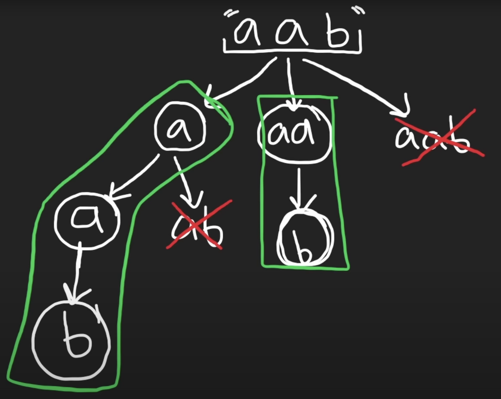

## 131. Palindrome Partitioning (Medium)
**Date and Time:** Jul 28, 2024, 17:42 (EST)

Link: https://leetcode.com/problems/palindrome-partitioning/

<br>

### Question:
Given a string `s`, partition `s` such that every substring of the partition is a palindrome. Return _all possible palindrome partitioning of_ `s`.

<br>

**Example 1:**
> **Input:** s = "aab"
> 
> **Output:** [["a","a","b"],["aa","b"]]

**Example 2:**
> **Input:** s = "a"
> 
> **Output:** [["a"]]

<br>

#### Constraints:
* `1 <= s.length <= 16`

* `s` contains only lowercase English letters.

<br>

### KeyPoints: 
In the for loop, we first add each element into `curr`, then after we add the last element, we `pop()` all the elements from `curr`, then we start appending from `j+1`, which is `'aa'`, then we call `backtrack(j+1)`, where `j = 1`, so we add `b` into `curr`, now we have `["aa", "b"]`. Lastly, we `pop()` out all elements again, and we check `j=2`, which is `aab`, we don't add this into curr.



```
i: 0, curr: ['a']
i: 1, curr: ['a', 'a']
i: 2, curr: ['a', 'a', 'b']
i: 0, curr: ['aa']
i: 2, curr: ['aa', 'b']
```

<br>

### Python Solution:
```python
class Solution:
    def partition(self, s: str) -> List[List[str]]:
        res, curr = [], []
        def backtrack(i):
            if i >= len(s):
                res.append(curr.copy())
                return
            for j in range(i, len(s)):
                if self.ispalin(s, i, j):
                    curr.append(s[i:j+1])
                    backtrack(j+1)
                    curr.pop()
        backtrack(0)
        return res

    def ispalin(self, s, l, r):
        while l < r:
            if s[l] != s[r]:
                return False
            l += 1
            r -= 1
        return True
```
**Time Complexity:** $O(n * 2^n)$, palindrome checking takes $O(n)$, and we have $O(2^n)$ subsets. <br>
**Space Complexity:** $O(2^n)$

<br>

### Java Solution:
Remember in Java `subset.add(s.substring(i, j+1))` for `subset.append(s[i:j+1])`.
```java
class Solution {
    public List<List<String>> partition(String s) {
        List<List<String>> res = new ArrayList<>();
        List<String> subset = new ArrayList<>();
        backtrack(s, 0, subset, res);
        return res;
    }   
    private void backtrack(String s, int i, List<String> subset, List<List<String>> res) {
        if (i == s.length()) {
            res.add(new ArrayList<>(subset));
            return;
        }
        for (int j = i; j < s.length(); j++) {
            if (isPalin(s, i, j)) {
                subset.add(s.substring(i, j+1));
                backtrack(s, j+1, subset, res);
                subset.remove(subset.size()-1);
            }
        }
    }
    private boolean isPalin(String s, int l, int r) {
        while (l < r) {
            if (s.charAt(l) != s.charAt(r)) {
                return false;
            }
            l++;
            r--;
        }
        return true;
    }
}
```

<br>

### C++ Solution:
In C++, we use `s.substr(index to start, size())` to get the substring.
```cpp
class Solution {
public:
    vector<vector<string>> partition(string s) {
        vector<vector<string>> res;
        vector<string> curr;
        backtrack(s, curr, res, 0);
        return res;
    }
    void backtrack(string& s, vector<string>& curr, vector<vector<string>>& res, int index) {
        if (index == s.size()) {
            res.push_back(curr);
            return;
        }
        for (int j = index; j < s.size(); j++) {
            if (ispalindrome(s, index, j)) {
                curr.push_back(s.substr(index, j - index + 1)); // Append substring s[index:j+1]
                backtrack(s, curr, res, j+1);
                curr.pop_back();
            }
        }   
    }
    bool ispalindrome(string s, int l, int r) {
        while (l < r) {
            if (s[l] != s[r]) {
                return false;
            }
            l++;
            r--;
        }
        return true;
    }
};
```

<br>

### Runtime and Memory comparison
|Language|Runtime|Memory|
|---|---|---|
|Python3|451 ms|35.3 MB|
|Java   |7 ms|57.2 MB|
|C++    |91 ms|57 MB|

<br>

