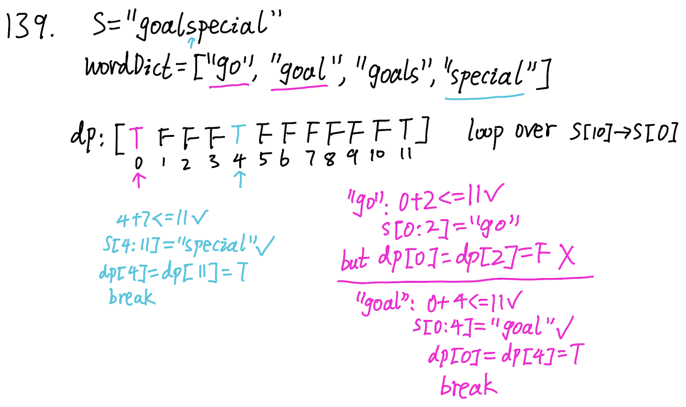

## 139. Word Break (Medium)
**Date and Time:** Jul 2, 2024, 16:01 (EST)

Link: https://leetcode.com/problems/word-break/

<br>

### Question:
Given a string `s` and a dictionary of strings `wordDict`, return `true` if `s` can be segmented into a space-separated sequence of one or more dictionary words.

**Note** that the same word in the dictionary may be reused multiple times in the segmentation.

<br>

**Example 1:**
> **Input:** s = "leetcode"
> 
> **Output:** wordDict = ["leet", "code"]
>
> **Explanation:**

**Example 2:**
> **Input:** s = "applepenapple"
> 
> **Output:** wordDict = ["apple", "pen"]
>
> **Explanation:**

**Example 3:**
> **Input:** s = "catsandog"
> 
> **Output:** wordDict = ["cats", "dog", "sand", "and", "cat"]
>
> **Explanation:**

**Example 4:**
> **Input:** s = "cars"
> 
> **Output:** wordDict = ["car", "ca", "rs"]

**Example 5:**
> **Input:** s = "aaaaaaa"
> 
> **Output:** wordDict = ["aaaa", "aaa"]

**Example 6:**
> **Input:** s = "goalspecial"
> 
> **Output:** wordDict = ["go", "goal", "goals", "special"]

<br>

### KeyPoints:
We set `dp` to be `[False] * len(s) + 1` and start updating the `dp` table from right to left, we set the last index of `dp` to be `True`, take example 6 as example: `s = "goalspecial"`, if we don't set `dp[11] = True`, then `dp[4]` will not be able to be set to `True`. We want each word in `s` to be consistent, so we want each beginning of a word to both be `True`, so it can pass cases like example 4, 5, and 6.



<br>

### Wrong Solution:
```python
class Solution:
    def wordBreak(self, s: str, wordDict: List[str]) -> bool:
        temp = ""
        for char in s:
            temp += char
            print(temp)
            if temp in wordDict:
                temp = ""
        return False if len(temp) != 0 else True
```

It will fail the case "s="aaaaaaa", wordDict = ["aaaa","aaa"]"

<br>

### My Solution:
```python
class Solution:
    def wordBreak(self, s: str, wordDict: List[str]) -> bool:
        dp = [False] * (len(s) + 1)
        dp[len(s)] = True
        for i in range(len(s)-1, -1, -1):
            for w in wordDict:
                if i + len(w) <= len(s) and s[i:i+len(w)] == w:
                    dp[i] = dp[i+len(w)]
                # If found the right word in wordDict, dp[i] will be True
                if dp[i]:
                    break
        return dp[0]
```
**Time Complexity:** $O(n * m)$, where `n = len(s), m = len(wordDict)`. <br>
**Space Complexity:** $O(n)$

<br>

