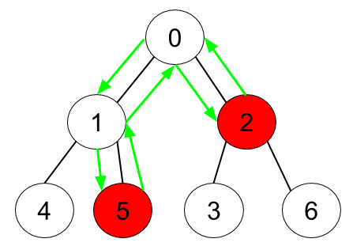

## 1443. Minimum Time to Collect All Apples in a Tree (Medium)
**Date and Time:** Dec 27, 2024, 23:03 (EST)

Link: https://leetcode.com/problems/minimum-time-to-collect-all-apples-in-a-tree

<br>

### Question:
Given an undirected tree consisting of `n` vertices numbered from `0` to `n-1`, which has some apples in their vertices. You spend 1 second to walk over one edge of the tree. Return the minimum time in seconds you have to spend to collect all apples in the tree, starting at **vertex 0** and coming back to this vertex.

The edges of the undirected tree are given in the array `edges`, where `edges[i] = [a_i, b_i]` means that exists an edge connecting the vertices `a_i` and `b_i`. Additionally, there is a boolean array `hasApple`, where `hasApple[i] = true` means that vertex `i` has an apple; otherwise, it does not have any apple.

<br>

**Example 1:**


> **Input:** n = 7, edges = [[0,1],[0,2],[1,4],[1,5],[2,3],[2,6]], hasApple = [false,false,true,false,true,true,false]
> 
> **Output:** 8
>
> **Explanation:** The figure above represents the given tree where red vertices have an apple. One optimal path to collect all apples is shown by the green arrows. 

**Example 2:**



> **Input:** n = 7, edges = [[0,1],[0,2],[1,4],[1,5],[2,3],[2,6]], hasApple = [false,false,true,false,false,true,false]
> 
> **Output:** 6
>
> **Explanation:** The figure above represents the given tree where red vertices have an apple. One optimal path to collect all apples is shown by the green arrows. 

**Example 3:**
> **Input:** n = 7, edges = [[0,1],[0,2],[1,4],[1,5],[2,3],[2,6]], hasApple = [false,false,false,false,false,false,false]
> 
> **Output:** 0

<br>

#### Constraints:
* `1 <= n <= 10^5`

* `edges.length == n - 1`

* `edges[i].length == 2`

* `0 <= a_i < b_i <= n - 1`

* `hasApple.length == n`

<br>

### Walk-through: 
First, build a adjacent graph to save each node with their neighbors. Then we run DFS to check if an apple exists in node's children, if so, we return `secs + 2`. Otherwise, if current `node` is Apple, we return `2` else `0`.

Finally, return `max(dfs(0)-2, 0)` to make sure we have at least `0` sec. And `dfs(0)-2` because if we only have one head that is apple, we should have `2-2=0` sec.

<br>

### Python Solution:
```python
class Solution:
    def minTime(self, n: int, edges: List[List[int]], hasApple: List[bool]) -> int:
        # Build graph
        # Run DFS to check if we have apple in the children, if so, update res with the cost
        
        # TC: O(n), n is total nodes, m=len(edges) SC: O(m)
        adj = collections.defaultdict(list)
        for u, v in edges:
            adj[u].append(v)
            adj[v].append(u)
        
        visited = set()
        def dfs(node):
            visited.add(node)
            secs = 0
            for nei in adj[node]:
                if nei not in visited:
                    secs += dfs(nei)
            # If children has apple, add the cost from head
            if secs > 0:
                return secs + 2
            # Return 2 if node is apple
            return 2 if hasApple[node] else 0
        return max(dfs(0)-2, 0)
```
**Time Complexity:** $O(n)$ <br>
**Space Complexity:** $O(m)$

<br>

