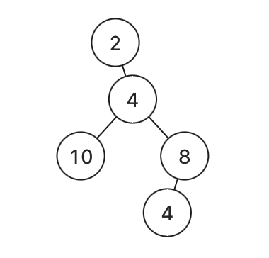

## 1448. Count Good Nodes in Binary Tree (Medium)
**Date and Time:** Oct 18, 2024, 16:16 (EST)

Link: https://leetcode.com/problems/count-good-nodes-in-binary-tree/

<br>

### Question:
Given a binary tree `root`, a node X in the tree is named **good** if in the path from root to X there are no nodes with a value greater than X.

Return the number of **good** nodes in the binary tree.

<br>

**Example 1:**


> **Input:** root = [3,1,4,3,null,1,5]
> 
> **Output:** 4
>
> **Explanation:** Nodes in blue are **good**. <br>
> Root Node (3) is always a good node. <br>
> Node 4 -> (3,4) is the maximum value in the path starting from the root. <br>
> Node 5 -> (3,4,5) is the maximum value in the path <br>
> Node 3 -> (3,1,3) is the maximum value in the path.

**Example 2:**


> **Input:** root = [3,3,null,4,2]
> 
> **Output:** 3
>
> **Explanation:** Node 2 -> (3, 3, 2) is not good, because "3" is higher than it.

**Example 3:**
> **Input:** root = [1]
> 
> **Output:** 1
>
> **Explanation:** Root is considered as **good**.

**Edge Case:**



> **Input:** root = [2,null,4,10,8,null,null,4]
> 
> **Output:** 4

<br>

#### Constraints:
* The number of nodes in the binary tree is in the range `[1, 10^5]`.

* Each node's value is between `[-10^4, 10^4]`.

<br>

### Walk-through: 
Run DFS from `root`, we use `prevNode` to keep track of the current path maximum value. Remember do not use a global var for `prevNode`, look at the edge case for why, we should only pass in this path's maximum `prevNode` into `dfs()` on its left and right.

<br>

### Python Solution:
```python
# Definition for a binary tree node.
# class TreeNode:
#     def __init__(self, val=0, left=None, right=None):
#         self.val = val
#         self.left = left
#         self.right = right
class Solution:
    def goodNodes(self, root: TreeNode) -> int:
        # Find a node X from root to this node with no value > X
        # Run DFS from the root, use a prev node to keep track of the max previous nodes
        # If a node >= prevNode, res += 1

        # TC: O(n), SC: O(1)
        res = 0
        prevNode = root.val    # Default, because root is always good
        def dfs(root, prevNode):
            nonlocal res
            if not root:
                return
            if root.val >= prevNode:
                prevNode = root.val
                res += 1
            dfs(root.left, prevNode)
            dfs(root.right, prevNode)
        
        dfs(root, prevNode)
        return res
```
**Time Complexity:** $O(n)$ <br>
**Space Complexity:** $O(1)$

<br>

