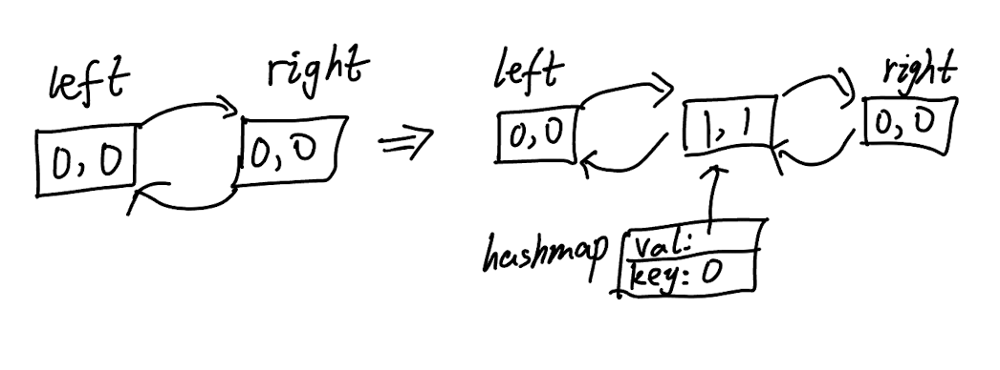

## 146. LRU Cache (Medium)
**Date and Time:** Aug 4, 2024, 17:47 (EST)

Link: https://leetcode.com/problems/lru-cache/

<br>

### Question:
Design a data structure that follows the constraints of a **Least Recently Used (LRU) cache**.

Implement the `LRUCache` class:

* `LRUCache(int capacity)` Initialize the LRU cache with **positive** size `capacity`.

* `int get(int key)` Return the value of the key if the key exists, otherwise return `-1`.

* `void put(int key, int value)` Update the value of the `key` if the `key` exists. Otherwise, add the `key-value` pair to the cache. If the number of keys exceeds the `capacity` from this operation, **evict** the least recently used key.

The functions `get` and `put` must each run in `O(1)` average time complexity.

<br>

**Example 1:**
> **Input:** ["LRUCache", "put", "put", "get", "put", "get", "put", "get", "get", "get"] <br> [[2], [1, 1], [2, 2], [1], [3, 3], [2], [4, 4], [1], [3], [4]]
> 
> **Output:** <br> [null, null, null, 1, null, -1, null, -1, 3, 4]
>
> **Explanation:** <br>
LRUCache lRUCache = new LRUCache(2); <br>
LRUCache.put(1, 1); // cache is {1=1} <br>
LRUCache.put(2, 2); // cache is {1=1, 2=2} <br>
LRUCache.get(1);    // return 1 <br>
LRUCache.put(3, 3); // LRU key was 2, evicts key 2, cache is {1=1, 3=3} <br>
LRUCache.get(2);    // returns -1 (not found) <br>
LRUCache.put(4, 4); // LRU key was 1, evicts key 1, cache is {4=4, 3=3} <br>
LRUCache.get(1);    // return -1 (not found) <br>
LRUCache.get(3);    // return 3 <br>
LRUCache.get(4);    // return 4

<br>

#### Constraints:
* `1 <= capacity <= 3000`

* `0 <= key <= 10^4`

* `0 <= value <= 10^5`

* At most `2 * 10^5` calls will be made to `get` and `put`.

<br>

### Walk-through: 
My naive approach is very simple, use `hashmap{}` and `lru[]` to keep track of the cache status, the `lru[]` is a `deque[]` so we can append the new element to the left to indicate the most recently used element. If we need to replace the least recently used element, which is the last element in `lru[]`, we can `pop()` to get it and remove this element in `hashmap{}` by `del hashmap[a]`.

The optimized approach uses **Doubly Linked List** with two dummy pointers `left` and `right` to keep track of the least recently used element and the most recently used element. We also use a hashmap{}'s val to save all the nodes, and the val is pointer to the node.



<br>

### Naive Python Solution:
```python
class LRUCache:

    def __init__(self, capacity: int):
        self.hashmap = {}
        self.capacity = capacity
        self.lru = collections.deque()

    def get(self, key: int) -> int:
        if key in self.lru:
            self.lru.remove(key)
            self.lru.appendleft(key)
        return self.hashmap[key] if key in self.hashmap else -1

    def put(self, key: int, value: int) -> None:
        if key in self.hashmap:
            self.hashmap[key] = value
            self.lru.remove(key)
            self.lru.appendleft(key)
        else:
            if len(self.hashmap.keys()) >= self.capacity:
                lastele = self.lru.pop()
                del self.hashmap[lastele]
            self.lru.appendleft(key)
            self.hashmap[key] = value

# Your LRUCache object will be instantiated and called as such:
# obj = LRUCache(capacity)
# param_1 = obj.get(key)
# obj.put(key,value)
```
**Time Complexity:** $O(n)$, where `n` is the `capacity`, because hashmap `put()` takes $O(1)$, but `get()` takes $O(n)$ to find and compare. <br>
**Space Complexity:** $O(n)$, where `n` is the `capacity`.

<br>

### Optimized Python Solution:
```python
class Node:
    def __init__(self, key, value):
        self.key, self.value = key, value
        self.prev = self.next = None

class LRUCache:

    def __init__(self, capacity: int):
        self.left, self.right = Node(0, 0), Node(0, 0)
        self.hashmap = {}
        self.capacity = capacity
        self.left.next, self.right.prev = self.right, self.left # Connect dummy nodes

    def remove(self, node):
        left, right = node.prev, node.next
        left.next, right.prev = right, left

    def insert(self, node):
        prev, nxt = self.right.prev, self.right
        prev.next = nxt.prev = node
        node.prev, node.next = prev, nxt

    def get(self, key: int) -> int:
        if key in self.hashmap:
            self.remove(self.hashmap[key])  # changes key to be MRU
            self.insert(self.hashmap[key])
            return self.hashmap[key].value
        return -1

    def put(self, key: int, value: int) -> None:
        if key in self.hashmap:
            self.remove(self.hashmap[key])
        self.hashmap[key] = Node(key, value)
        self.insert(self.hashmap[key])

        if len(self.hashmap) > self.capacity:
            del self.hashmap[self.left.next.key]
            self.remove(self.left.next)
        
# Your LRUCache object will be instantiated and called as such:
# obj = LRUCache(capacity)
# param_1 = obj.get(key)
# obj.put(key,value)
```
**Time Complexity:** $O(1)$, since `get` and `put` only run in $O(1)$ average time complexity. <br>
**Space Complexity:** $O(n)$, where `n` is the `capacity`. Because we only store the `capacity` of elements in `hashmap{}`.

<br>

