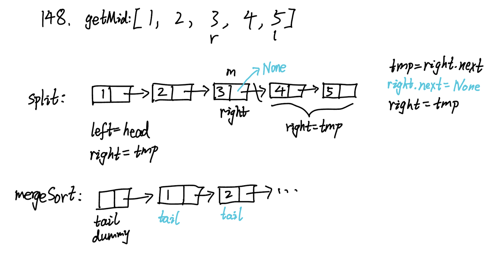

## 148. Sort List (Medium)
**Date and Time:** Jun 24, 2024, 12:16 (EST)

Link: https://leetcode.com/problems/sort-list/

<br>

### Question:
Given the `head` of a linked list, return _the list after sorting it in **ascending order**_.

<br>

**Example 1:**


> **Input:** head = [4, 2, 1, 3]
> 
> **Output:** [1, 2, 3, 4]

**Example 2:**


> **Input:** head = [-1, 5, 3, 4, 0]
> 
> **Output:** [-1, 0, 3, 4, 5]

**Example 3:**
> **Input:** head = [ ]
> 
> **Output:** [ ]

<br>

### KeyPoints:
This question is type of "Divide and Conquer", we first divide from the middle of `head` by running "fast and slow" algorithm, and we assign it to `right`, then we cut the `head` into two parts: `left` and `right`. Then we have `l1, l2` by recursively calling `self.sortList(left), self.sortList(right)` and finally merge them together.

The core idea is to use `mergeSort` to sort the linked list. The first step is to find the mid-point and recursively split and sort the left and right, then we compare to append element to `tail.next`.

When the fast ptr reaches the end, we just return the slow ptr as mid-point. Because the mid-point.next is the right list.



<br>

### My Solution:
```python
# Definition for singly-linked list.
# class ListNode:
#     def __init__(self, val=0, next=None):
#         self.val = val
#         self.next = next
class Solution:
    def sortList(self, head: Optional[ListNode]) -> Optional[ListNode]:
        # Perform sorting algorithm (Merge Sort) in Linked List
        # Base case, if head is single node, return node
        if not head or not head.next:
            return head
        left = head
        # Split in the middle
        right = self.getMid(head)
        tmp = right.next
        right.next = None
        right = tmp
        # Recursively split the lists
        l1, l2 = self.sortList(left), self.sortList(right)
        # Merge step
        return self.mergeSort(l1, l2)
    
    def getMid(self, head):
        slow, fast = head, head.next
        while fast and fast.next:
            slow = slow.next
            fast = fast.next.next
        return slow
    
    def mergeSort(self, l1, l2):
        tail = dummy = ListNode()
        while l1 and l2:
            if l1.val < l2.val:
                tail.next = l1
                l1 = l1.next
            else:
                tail.next = l2
                l2 = l2.next
            tail = tail.next
        # Add the rest into tail.next
        if l1:
            tail.next = l1
        if l2:
            tail.next = l2
        return dummy.next
```
Time Complexity: $O(n\cdot log\ n)$, $O(log\ n)$ time to split the linked list, and $O(n)$ to sort the whole elements in the end. <br>
Space Complexity: $O(log\ n)$, because we implemented merge sort in Linked List not an array ($O(n)$).

<br>

