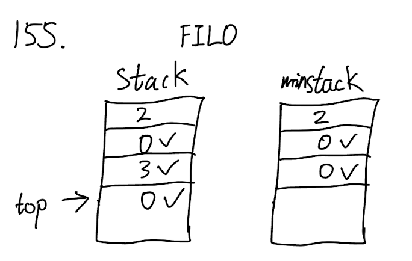

## 155. Min Stack (Medium)

Link: https://leetcode.com/problems/min-stack/

<br>

### Question:
Design a stack that supports push, pop, top, and retrieving the minimum element in constant time.

Implement the `MinStack` class:

- `MinStack()` initializes the stack object.

- `void push(int val)` pushes the element `val` onto the stack.

- `void pop()` removes the element on the top of the stack.

- `int top()` gets the top element of the stack.

- `int getMin()` retrieves the minimum element in the stack.

You must implement a solution with `O(1)` time complexity for each function.

<br>

**Example 1:**
> **Input** <br>
> ["MinStack", "push", "push", "push", "getMin", "pop", "top", "getMin"] <br>
> [ [], [-2], [0], [-3], [], [], [], [] ]
> 
> **Output** <br>
> [null, null, null, null, -3, null, 0, -2]
> 
> **Explanation** <br>
> MinStack minStack = new MinStack(); <br>
> minStack.push(-2); <br>
> minStack.push(0); <br>
> minStack.push(-3); <br>
> minStack.getMin(); // return -3 <br>
> minStack.pop(); <br>
> minStack.top();    // return 0 <br>
> minStack.getMin(); // return -2 <br>

**Example 2:**
> **Input** <br>
> ["MinStack", "push", "push", "push", "push", "getMin", "pop", "getMin", "pop", "getMin", "pop", "getMin"] <br>
> [ [], [2], [0], [3], [0], [], [], [], [], [], [], [] ]
> 
> **Output** <br>
> [null, null, null, null, null, 0, null, 0, null, 0, null, 2]

<br>

### KeyPoints: 


<br>

### Wrong answer:
The `getMin(self)` does not meet O(1) requirement, should build a Min Stack to keep track of it.
```python
class MinStack:

    def __init__(self):
        self.stack = []

    def push(self, val: int) -> None:
        self.stack.append(val)

    def pop(self) -> None:
        self.stack.pop()

    def top(self) -> int:
        return self.stack[-1]  # last element is the top

    def getMin(self) -> int:
        return min(self.stack)


# Your MinStack object will be instantiated and called as such:
# obj = MinStack()
# obj.push(val)
# obj.pop()
# param_3 = obj.top()
# param_4 = obj.getMin()
```

<br>

### My Solution:
First create the stack and minstack to keep track of the min vals. For `push()`, we add `val` to the top of the `minstack` when val is the first element or the current `val` is less than the current smallest element in `minstack`. For `pop()`, since we want to keep track of the smallest val in the `minstack`, so if the `stack` removes the top element which is also the smallest element the `minstack`, we want to update the `minstack` as well, (i.e. update the smallest element in `minstack`). Finally, remember `getMin()` should return the smallest value in `minstack` to reach O(1) time complexity, not `self.minstack.pop()` to get the smallest value, which will remove the current smallest element in `minstack` while this element is still in `stack`.
```python
class MinStack:

    def __init__(self):
        self.stack = []
        self.minstack = []

    def push(self, val: int) -> None:
        self.stack.append(val)
        # If minstack is none or have a smaller val
        if not self.minstack or val <= self.minstack[-1]:
            self.minstack.append(val)

    def pop(self) -> None:
        val = self.stack.pop()
        # If the top of stack is also the top of minstack
        if self.minstack and val == self.minstack[-1]:
            self.minstack.pop()

    def top(self) -> int:
        return self.stack[-1]  # last element is the top

    def getMin(self) -> int:
        # Should not use pop(), but only return the last element
        return self.minstack[-1]
```

<br>

