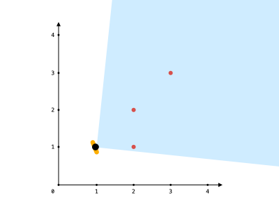
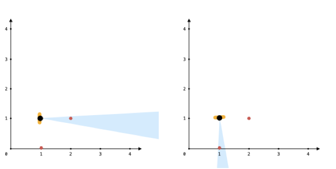

## 1610. Maximum Number of Visible Points (Hard)
**Date and Time:** Jun 12, 2026

Link: https://leetcode.com/problems/maximum-number-of-visible-points/

<br>

### Question:
You are given an array `points`, an integer `angle`, and your `location`, where `location = [posx, posy]` and `points[i] = [xi, yi]` both denote **integral coordinates** on the X-Y plane.

Initially, you are facing directly east from your location. You **cannot move** from your location, but you can **rotate**. For every `angle` degrees you rotate counterclockwise, you can see all the points that lie in that view. Your view includes the boundary of this range.

Return _the maximum number of points you can see_.

<br>

**Example 1:**



> **Input:** points = [[2,1],[2,2],[3,3]], angle = 90, location = [1,1] <br>
> **Output:** 3 <br>
> **Explanation:** All points can be seen when looking towards the northeast, with an angle of 90°.

**Example 2:**
> **Input:** points = [[2,1],[2,2],[3,4],[1,1]], angle = 90, location = [1,1] <br>
> **Output:** 4 <br>
> **Explanation:** All points can be seen when looking towards the north, with an angle of 90°. Note that the location itself is one of the points.

**Example 3:**



> **Input:** points = [[1,0],[2,1]], angle = 13, location = [1,1] <br>
> **Output:** 1

<br>

#### Constraints:
* `1 <= points.length <= 10^5`

* `points[i].length == 2`

* `location.length == 2`

* `0 <= angle < 360`

* `0 <= posx, posy, xi, yi <= 100`

<br>

### Walk-through:
1. For each point, if it equals `location`, count it separately (`origin`). Otherwise, convert it to a degree angle from `location` using `math.atan2(dy, dx)`.

2. **Normalize for wrap-around:** for every negative degree in `degList`, append `degree + 360`. This lets the sliding window handle viewing angles that straddle the 0°/360° boundary.

   **Edge case:** `points = [[0,0],[0,2]], angle = 90, location = [1,1]`
   - `[0,0]` → dy = -1, dx = -1 → atan2(-1,-1) = **-135°**
   - `[0,2]` → dy = 1, dx = -1 → atan2(1,-1) = **135°**
   - Without `+360`: sorted = `[-135, 135]`; window spans 270° > 90° → max = 1 (**wrong**)
   - With `+360`: sorted = `[-135, 135, 225]`; window `[135, 225]` spans 90° → **2 points** ✓

3. Sort `degList` and apply a **sliding window**: advance `r`, keep `degList[r] - degList[l] <= angle`; if exceeded, increment `l`. Track `max(r - l + 1)`.

4. Return `res + origin`.

<br>

### Python Solution:
```python
class Solution:
    def visiblePoints(self, points: List[List[int]], angle: int, location: List[int]) -> int:
        # Q: Find the max points we can see from location go counterclockwise with angle
        # S: 1. Calculate the degree from location to each points add into a list[]
        # 2. Count the points == location
        # 3. For -degree, +360 to normalize them, then sort degreeList
        # 4. Use sliding window to find the max points we can cover with range in angle
        # TC: O(nlogn), n=len(points), SC: O(n)

        degList = []
        res = 0
        origin = 0
        # 1. Convert points into degree
        for pt in points:
            # Check if we have the same pt
            if pt == location:
                origin += 1
            else:
                dy, dx = pt[1] - location[1], pt[0] - location[0]
                degree = math.degrees(math.atan2(dy, dx))
                degList.append(degree)
        # 2. Sort degList
        # Handle -degree to plus 360
        for degree in degList:
            if degree < 0:
                degList.append(degree+360)
        degList.sort()
        # 3. Use sliding window to find the max pts can be seen within angle
        l = 0
        for r in range(len(degList)):
            if degList[r] - degList[l] <= angle:
                res = max(res, r-l+1)
            else:
                l += 1
        return res + origin
```
**Time Complexity:** $O(n \log n)$, `n = len(points)`, dominated by sorting `degList`. <br>
**Space Complexity:** $O(n)$, for `degList` (at most `2n` entries after the wrap-around duplication).

<br>


