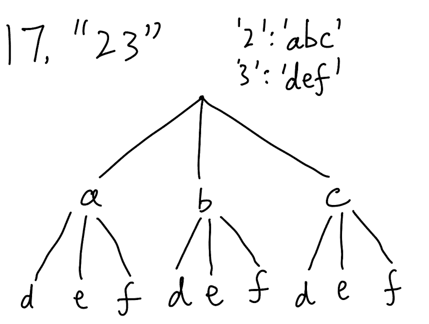

## 17. Letter Combinations of a Phone Number (Medium)
**Date and Time:** Jun 22, 2024, 22:53 (EST)

Link: https://leetcode.com/problems/letter-combinations-of-a-phone-number/

<br>

### Question:
Given a string containing digits from `2-9` inclusive, return all possible letter combinations that the number could represent. Return the answer in __any order__.

A mapping of digits to letters (just like on the telephone buttons) is given below. Note that 1 does not map to any letters.


<br>

**Example 1:**
> **Input:** digits = "23"
> 
> **Output:** ["ad", "ae", "af", "bd", "be", "bf", "cd", "ce", "cf"]

**Example 2:**
> **Input:** digits = ""
> 
> **Output:** [ ]

**Example 3:**
> **Input:** digits = "2"
> 
> **Output:** ["a", "b", "c"]

<br>

### KeyPoints: 

<p align="center">


### Demo with print statement:
```python
class Solution:
    def letterCombinations(self, digits: str) -> List[str]:
        # Also similar backtracking approach, run dfs
        digitsMap = {
            '2': 'abc',
            '3': 'def',
            '4': 'ghi',
            '5': 'jkl',
            '6': 'mno',
            '7': 'pqrs',
            '8': 'tuv',
            '9': 'wxyz'
        }
        res = []
        curr = ''
        def backtrack(i, curr):
            print(f"i: {i}")
            print(f"curr: {curr}")
            if len(curr) == len(digits):
                res.append(curr)
                return
            for c in digitsMap[digits[i]]:
                print(f"return to: {i}\ncurr: {curr}\n")
                backtrack(i + 1, curr + c)
        if digits:
            backtrack(0, curr)
        return res
```

```
i: 0
curr: 
return to: 0
curr: 

i: 1
curr: a
return to: 1
curr: a

i: 2
curr: ad
return to: 1
curr: a

i: 2
curr: ae
return to: 1
curr: a

i: 2
curr: af
return to: 0
curr: 

i: 1
curr: b
return to: 1
curr: b

i: 2
curr: bd
return to: 1
curr: b

i: 2
curr: be
return to: 1
curr: b

i: 2
curr: bf
return to: 0
curr: 

i: 1
curr: c
return to: 1
curr: c

i: 2
curr: cd
return to: 1
curr: c

i: 2
curr: ce
return to: 1
curr: c

i: 2
curr: cf
```

<br>

### My Solution:
```python

```
<br>

