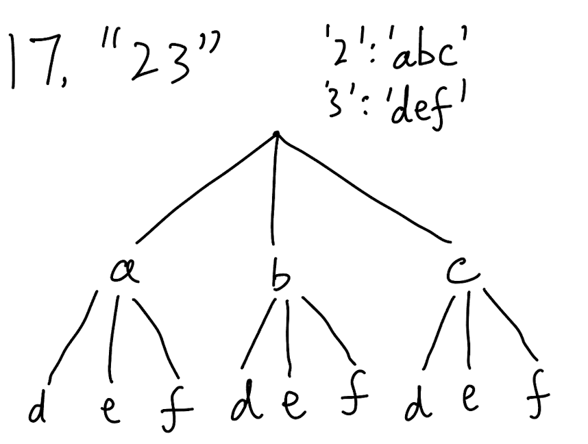

## 17. Letter Combinations of a Phone Number (Medium)
**Date and Time:** Jun 22, 2024, 22:53 (EST)

Link: https://leetcode.com/problems/letter-combinations-of-a-phone-number/

<br>

### Question:
Given a string containing digits from `2-9` inclusive, return all possible letter combinations that the number could represent. Return the answer in __any order__.

A mapping of digits to letters (just like on the telephone buttons) is given below. Note that 1 does not map to any letters.


<br>

**Example 1:**
> **Input:** digits = "23"
> 
> **Output:** ["ad", "ae", "af", "bd", "be", "bf", "cd", "ce", "cf"]

**Example 2:**
> **Input:** digits = ""
> 
> **Output:** [ ]

**Example 3:**
> **Input:** digits = "2"
> 
> **Output:** ["a", "b", "c"]

<br>

### Walk-through: 
This is also the typical backtracking question, find the base case then run dfs to append all the combinations.

This is the dfs with Preorder traversal.

<p align="center">



<br>

### Solution:
May 31, 2026, [Time Taken 29m 59s] <br> Cannot directly use subset.append(), it is in-place.
```python
class Solution:
    def letterCombinations(self, digits: str) -> List[str]:
        # Q: Given digits, map digit to letter, and form all combinations
        # S: 1. Map digit to chars
        # 2. Use subset[] to save current combination until len(subset) == len(digits), with index i to indicate which digit in digits
        # 3. When len(subset) == len(digits), append subset to res[], then pop the last char from subset

        # TC: O(n^len(digits)), n=max char for 1 digit, SC: O(n^len(digits))
        preMap = {'2': ['a', 'b', 'c'], '3': ['d', 'e', 'f'], '4': ['g', 'h', 'i'], '5': ['j', 'k', 'l'], '6': ['m', 'n', 'o'], '7': ['p', 'q', 'r', 's'], '8': ['t', 'u', 'v'], '9': ['w', 'x', 'y', 'z']}
        res = []
        def backtrack(subset, i):
            # Base case
            if len(subset) == len(digits):
                res.append("".join(subset))
                return
            # Process next digit's chars
            for char in preMap[digits[i]]:
                subset.append(char)
                backtrack(subset, i+1)
                subset.pop()
            return
            
        backtrack([], 0)
        return res
```
__Time Complexity:__ $O(n\cdot4^n)$, where `n` is the length of `digits`. Consider the worst case number of combinations (n=4, "9999"), we have $4^n$ combinations. $O(n)$ for each "".join method, because we need to concat each char one by one.

__Space Complexity__: $O(n\cdot4^n)$, a complete string takes $O(n)$ to save, we have up to $4^n$ strings to save.

<br>

### Solution:
```python
class Solution:
    def letterCombinations(self, digits: str) -> List[str]:
        # Build a hashmap for digits mapping
        # Run Backtrack for each digits
        # For all combination of the first digit, we try the next
        # Base case 1: len(curr) == len(digits), append str, return
        # base case 2: i >= len(digits), return 

        # TC: O(n * 4^n), SC: O(n* 4^n)
        hashmap = {"2": "abc", "3": "def", "4": "ghi", "5": "jkl", "6": "mno", "7": "pqrs", "8": "tuv", "9": "wxyz"}

        res = []
        def backtrack(i, curr):
            if len(curr) == len(digits):
                res.append(curr)
                return
            if i == len(digits):
                return
            for c in hashmap[digits[i]]:
                backtrack(i+1, curr + c)

        if digits:
            backtrack(0, "")
        return res
```
__Time Complexity:__ $O(n\cdot4^n)$, where `n` is the length of `digits`. Consider the worst case number of combinations (n=4, "9999"), then multiply the length of the output string we have, which is the same as length of input string.

__Space Complexity__: $O(n\cdot4^n)$, same as time complexity in the worst case.

<br>

