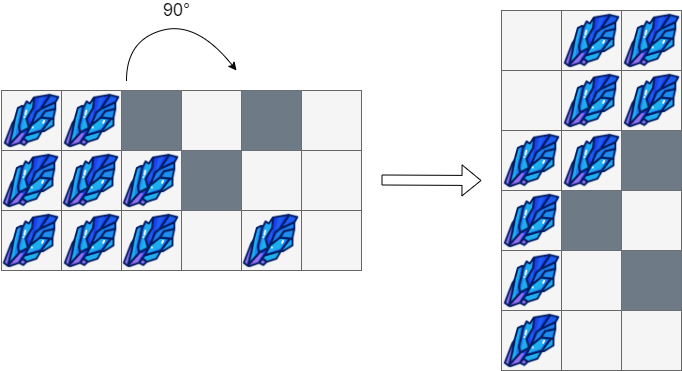

## 1861. Rotating the Box (Medium)
**Date and Time:** Nov 26, 2024, 23:03 (EST)

Link: https://leetcode.com/problems/rotating-the-box

<br>

### Question:
You are given an `m x n` matrix of characters `boxGrid` representing a side-view of a box. Each cell of the box is one of the following:

* A stone `'#'`

* A stationary obstacle `'*'`

* Empty `'.'`

The box is rotated **90 degrees clockwise**, causing some of the stones to fall due to gravity. Each stone falls down until it lands on an obstacle, another stone, or the bottom of the box. Gravity **does not** affect the obstacles' positions, and the inertia from the box's rotation **does not** affect the stones' horizontal positions.

It is **guaranteed** that each stone in `boxGrid` rests on an obstacle, another stone, or the bottom of the box.

Return an `n x m` matrix representing the box after the rotation described above.

<br>

**Example 1:**


> **Input:** boxGrid = [["#",".","#"]]
> 
> **Output:**
```
[["."],
 ["#"],
 ["#"]]
```

**Example 2:**


> **Input:** boxGrid = [["#",".","*","."], ["#","#","*","."]]
> 
> **Output:**
```
 [["#","."],
  ["#","#"],
  ["*","*"],
  [".","."]]
```

**Example 3:**



> **Input:** boxGrid = [["#","#","*",".","*","."],
              ["#","#","#","*",".","."],
              ["#","#","#",".","#","."]]
> 
> **Output:**
```
[[".","#","#"],
 [".","#","#"],
 ["#","#","*"],
 ["#","*","."],
 ["#",".","*"],
 ["#",".","."]]
```

<br>

#### Constraints:
* `m == boxGrid.length`

* `n == boxGrid[i].length`

* `1 <= m, n <= 500`

* `boxGrid[i][j]` is either `'#'`, `'*'`, or `'.'`.

<br>

### Walk-through: 
1. We use two pointers `c` to keep track of current entry, `i` to keep track of available to room to swap with current entry (if it's stone). If current entry `box[r][c] == '*'`s, then we need to update `i = c - 1` (no available room after stone anymore), and we are traversing from right column to the left column, bottom row to the top row. If current entry `box[r][c] = '#'`, we can perform the swap between `c` and `i` ptrs.

2. After we move all the stones to the corresponding positions, we start converting each column of the original matrix into each row for the new matrix. Remeber to start from the left column, bottom row to the top row, so we can successfully get the converted row.

<br>

### Python Solution:
```python
class Solution:
    def rotateTheBox(self, box: List[List[str]]) -> List[List[str]]:
        # 1. Modify the matrix to shift stones backward
        # Use two ptrs i, c to keep track of current stone pos and the available pos
        # 2. After we shifted the matrix, we start converting it to the new n x m matrix, col -> row, row -> col
        
        # TC: O(m x n), SC: O(n x m)
        rows, cols = len(box), len(box[0])
        res = []
        # Traverse the matrix backward to shift stones
        for r in range(rows-1, -1, -1):
            i = cols-1      # ptr to indicate available '.'
            for c in range(cols-1, -1, -1):
                # Obstacle: move i ptr to be c + 1
                if box[r][c] == '*':
                    i = c - 1
                # Stone: shift its pos to i ptr
                elif box[r][c] == '#':
                    box[r][i], box[r][c] = box[r][c], box[r][i]
                    i -= 1
        # Rotate the matrix by append col by col: 0th col -> 0th row
        for c in range(cols):
            tmp = []
            # append entry from bottom row to top
            for r in range(rows-1, -1, -1):
                tmp.append(box[r][c])
            res.append(tmp)
        return res
```
**Time Complexity:** $O(m * n)$ <br>
**Space Complexity:** $O(n * m)$

<br>

