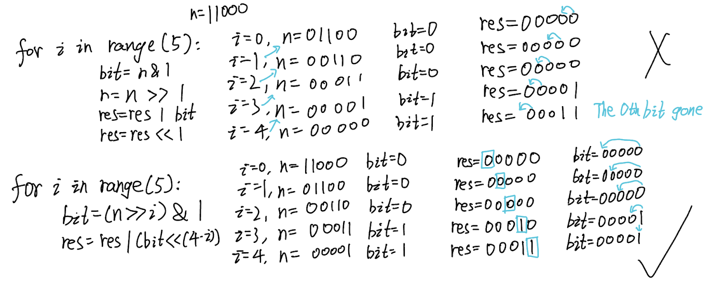

## 190. Reverse Bits (Easy)
**Date and Time:** Jul 1, 2024, 23:45 (EST)

Link: https://leetcode.com/problems/reverse-bits/

<br>

### Question:
Reverse bits of a given 32 bits unsigned integer.

**Note:**

* Note that in some languages, such as Java, there is no unsigned integer type. In this case, both input and output will be given as a signed integer type. They should not affect your implementation, as the integer's internal binary representation is the same, whether it is signed or unsigned.

* In Java, the compiler represents the signed integers using 2's complement notation. Therefore, in **Example 2** above, the input represents the signed integer `-3` and the output represents the signed integer `-1073741825`.

<br>

**Example 1:**
> **Input:** n = 00000010100101000001111010011100
> 
> **Output:**    964176192 (00111001011110000010100101000000)
>
> **Explanation:** The input binary string **00000010100101000001111010011100** represents the unsigned integer 43261596, so return 964176192 which its binary representation is **00111001011110000010100101000000**.

**Example 2:**
> **Input:** n = 11111111111111111111111111111101
> 
> **Output:**   3221225471 (10111111111111111111111111111111)
>
> **Explanation:** The input binary string **11111111111111111111111111111101** represents the unsigned integer 4294967293, so return 3221225471 which its binary representation is **10111111111111111111111111111111**.

<br>

### KeyPoints: 
Repeat the for loop 32 times since we're only given 32 bits unsigned integer. 
1. n >> 1, shift n right by 1 bit, then n & 1 to get the last bit of n. 
2. res | `bit` by shifting `bit` to the left.

**Note**: There was a mistake I made when I tried to perform bit manipulation to shift the bits. I should only shift the n to `i` bits in the for loop, same as when I need to shift the `31 - i` bit for `bit` (shift at most 31 bits because the $0^\text{th}$ bit is 1 bit). See below for differences.



<br>

### My Solution:
```python
class Solution:
    def reverseBits(self, n: int) -> int:
        res = 0
        for i in range(32):
            bit = (n >> i) & 1   # 0 or 1
            res = res | (bit << (31 - i))
        return res
```
**Time Complexity:** $O(n)$ <br>
**Space Complexity:** $O(n)$

<br>

