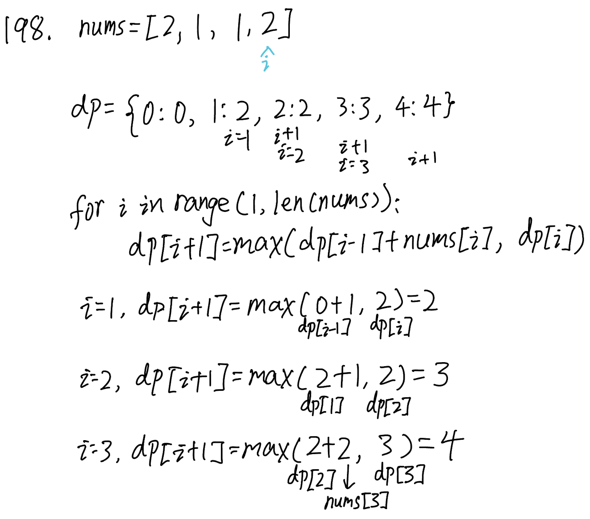

## 198. House Robber (Medium)
**Date and Time:** Jul 2, 2024, 11:55 (EST)

Link: https://leetcode.com/problems/house-robber/

<br>

### Question:
You are a professional robber planning to rob houses along a street. Each house has a certain amount of money stashed, the only constraint stopping you from robbing each of them is that adjacent houses have security systems connected and **it will automatically contact the police if two adjacent houses were broken into on the same night.**

Given an integer array `nums` representing the amount of money of each house, return _the maximum amount of money you can rob tonight **without alerting the police**._

<br>

**Example 1:**
> **Input:** nums = [1, 2, 3, 1]
> 
> **Output:** 4
>
> **Explanation:** Rob house 1 (money = 1) and then rob house 3 (money = 3). Total amount you can rob = 1 + 3 = 4.

**Example 2:**
> **Input:** nums = [2, 7, 9, 3, 1]
> 
> **Output:** 12
>
> **Explanation:** Rob house 1 (money = 2), rob house 3 (money = 9) and rob house 5 (money = 1). Total amount you can rob = 2 + 9 + 1 = 12.

**Example 3:**
> **Input:** [1, 4, 2, 5]
> 
> **Output:** 9

**Edge Case:**
> **Input:** [2, 1, 1, 2]
> 
> **Output:** 4

<br>

### KeyPoints: 
The recursive relation should be `rob = max(rob[i-2] + val, rob[i-1])`, which updates `dp[i]` to `dp[i-2] + nums[i]` or `dp[i-1]`. Then, we initialize `dp={}` with `dp[0]=0, dp[1]=nums[0]`, and we return the `dp[len(nums)]` in the end, because it takes the `max()` between previous elements.

The values we store in each index in `dp` is the maximum value we can get from previous steps, e.g. `nums = [1,2,3,1], dp={0: 0, 1: 1, 2: 2, 3: 4, 4: 4}`, where `dp[2]=2` is the max value between `dp[0]+nums[1]=0+2` and `dp[1]=1`. For `dp[3] = 4`, we compare `dp[2] = 2, dp[1] + nums[i] = 1 + 3 = 4`. So, we look at `dp` for the `dp[i-2]` value, then add it with `nums[i]` and compare with `dp[i-1]`, which looks for if we should take `dp[i-1]` or (`dp[i-2], nums[i]`).



<br>

### Wrong Solution:
This recursive relation is close, but it is wrong. We should not just choose `rob = max(res, dp[i])`, where `dp[i]` only considers current `nums[i]` or `dp[i-2] + nums[i]`.
```python
class Solution:
    def rob(self, nums: List[int]) -> int:
        dp = {}
        for i in range(1, len(nums)):
            if (i - 2) in dp:
                dp[i] = dp[i-2] + nums[i]
            else:
                dp[i] = nums[i]
            res = max(res, dp[i])
        return res
```

<br>

### Solution:
```python
class Solution:
    def rob(self, nums: List[int]) -> int:
        dp = {}
        dp[0] = 0
        dp[1] = nums[0]
        for i in range(1, len(nums)):
            dp[i+1] = max(dp[i], dp[i-1] + nums[i])
        return dp[len(nums)]
```
**Time Complexity:** $O(n)$ <br>
**Space Complexity:** $O(n)$

<br>

