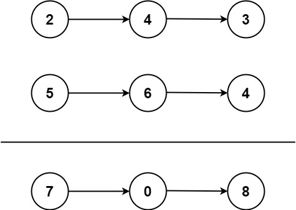

## 2. Add Two Numbers (Medium)

Link: https://leetcode.com/problems/add-two-numbers/

**Date and Time:** May 26, 2024 <br>

<br>

### Question:
You are given two **non-empty** linked lists representing two non-negative integers. The digits are stored in **reverse order**, and each of their nodes contains a single digit. Add the two numbers and return the sum as a linked list.

You may assume the two numbers do not contain any leading zero, except the number 0 itself.

<br>

**Example 1:**



> **Input:** l1 = [2,4,3], l2 = [5,6,4]
> 
> **Output:** [7,0,8]
>
> **Explanation:** 342 + 465 = 807.

**Example 2:**
> **Input:** l1 = [0], l2 = [0]
> 
> **Output:** [0]

**Example 3:**
> **Input:** l1 = [9,9,9,9,9,9,9], l2 = [9,9,9,9]
> 
> **Output:** [8,9,9,9,0,0,0,1]

**Edge Case:**
> **Input:** l1 = [2,4], l2 = [5,6,3]
> 
> **Output:** [7,0,4]

**Edge Case:**
> **Input:** l1 = [2,4], l2 = [5,6]
> 
> **Output:** [7,0,1]

<br>

### Constraints: 
* The number of nodes in each linked list is in the range `[1, 100]`.

* `0 <= Node.val <= 9`

* It is guaranteed that the list represents a number that does not have leading zeros.

<br>

### Walk-through: 
This question is very similar to [415. Add Strings](./415.Add_Strings(Easy).md).

We first create a dummy node to save the sum as linked list. We have `dummy = curr = ListNode()` so we can use `curr.next` to save the sum of two nodes. 

If `l1` or `l2` is out of bound, we can just set the value to be `0`. We use `carry` to keep track of previous summation is >= 10 or not. Each time we assign `curr.next` to be `(v1 + v2 + carry) % 10`, and update `carry = (v1 + v2 + carry) // 10`. Then, we update `l1` and `l2`.

Finally, we check if `carry` has remaining val to add, if so, we assign `curr.next = carry`. And we return `dummy.next`.


<br>

### Python Solution:
```python
# Definition for singly-linked list.
# class ListNode:
#     def __init__(self, val=0, next=None):
#         self.val = val
#         self.next = next
class Solution:
    def addTwoNumbers(self, l1: Optional[ListNode], l2: Optional[ListNode]) -> Optional[ListNode]:
        # Compare l1 and l2, if one of them is empty set it to be 0
        # Use carry to keep track of carry bit
        # Use dummy = curr to assign sum in linked list
        # Check if carry: set carry to curr.next

        # TC: O(max(n, m)), n=len(l1), m=len(l2), SC: O(max(n, m))
        carry = 0
        dummy = curr = ListNode()
        while l1 or l2:
            v1 = l1.val if l1 else 0
            v2 = l2.val if l2 else 0
            curr.next = ListNode((v1 + v2 + carry) % 10)
            curr = curr.next
            carry = (v1 + v2 + carry) // 10
            # Update linked lists
            if l1:
                l1 = l1.next
            if l2:
                l2 = l2.next
        # Check carry
        if carry:
            curr.next = ListNode(carry)
        return dummy.next
```
**Time Complexity:** $O(\text{max(n, m)})$ <br>
**Space Complexity:** $O(\text{max(n, m)})$

<br>

