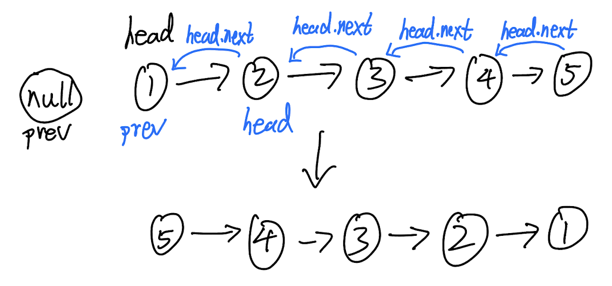

## 206. Reverse Linked List (Easy)
**Date and Time:** Jul 30, 2024, 22:54 (EST)

Link: https://leetcode.com/problems/reverse-linked-list/

<br>

|Date|Stopwatch|Y/N|Feedback|
|---|---|---|----------|
|Jun 20, 2025|6m40s|Y||

<br>

### Question:
Given the `head` of a singly linked list, reverse the list, and return _the reversed list_.

<br>

**Example 1:**


> **Input:** head = [1,2,3,4,5]
> 
> **Output:** [5,4,3,2,1]

**Example 2:**


> **Input:** head = [1,2]
> 
> **Output:** [2, 1]

**Example 3:**
> **Input:** head = []
> 
> **Output:** []

<br>

#### Constraints:
* The number of nodes in the list is the range `[0, 5000]`.

* `-5000 <= Node.val <= 5000`

<br>

### Walk-through: 
Save the copy of `head.next` into `next_node`, because we need to temporarily connect `head` with previous reversed nodes. Set `head.next = prev`, so the current `head` will be connected with all the previous reversed nodes. Later, update `head` back to the original `head.next` nodes.



<br>

### Python Solution:
```python
# Definition for singly-linked list.
# class ListNode:
#     def __init__(self, val=0, next=None):
#         self.val = val
#         self.next = next
class Solution:
    def reverseList(self, head: Optional[ListNode]) -> Optional[ListNode]:
        # prev: null to previous node
        # Each time, save the copy of head.next, and set head.next to prev, prev = head
        # TC: O(n), n is total nodes, SC: O(1)

        prev = None
        while head:
            next_node = head.next
            head.next = prev
            prev = head
            head = next_node
        return prev
```
**Time Complexity:** $O(n)$ <br>
**Space Complexity:** $O(1)$

<br>

### C++ Solution:
```cpp
/**
 * Definition for singly-linked list.
 * struct ListNode {
 *     int val;
 *     ListNode *next;
 *     ListNode() : val(0), next(nullptr) {}
 *     ListNode(int x) : val(x), next(nullptr) {}
 *     ListNode(int x, ListNode *next) : val(x), next(next) {}
 * };
 */
class Solution {
public:
    ListNode* reverseList(ListNode* head) {
        ListNode* prev = nullptr;
        while (head) {
            ListNode* tmp = head->next;
            head->next = prev;
            prev = head;
            head = tmp;
        }
        return prev;
    }
};
```

<br>

