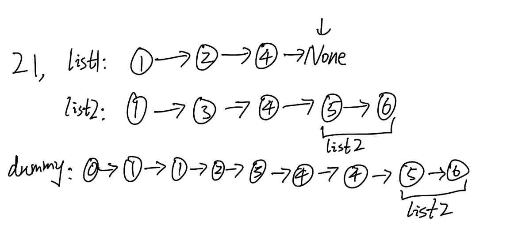

## 21. Merge Two Sorted Lists (Easy)
**Date and Time:** May 26, 2024 <br>
**Update:** Jul 30, 2024

Link: https://leetcode.com/problems/merge-two-sorted-lists/

<br>

### Question:
You are given the heads of two sorted linked lists `list1` and `list2`.

Merge the two lists into one **sorted** list. The list should be made by splicing together the nodes of the first two lists.

Return _the head of the merged linked list_.

<br>

**Example 1:**


> **Input:** list1 = [1, 2, 4], list2 = [1, 3, 4]
> 
> **Output:** [1, 1, 2, 3, 4, 4]

**Example 2:**
> **Input:** list1 = [], list2 = []
> 
> **Output:** []

**Example 3:**
> **Input:** list1 = [], list2 = [0]
> 
> **Output:** [0]

**Edge case:**
> **Input:** list1 = [1,2,4], list2 = [1,3,4,5,6,7]
> 
> **Output:** [1,1,2,3,4,4,5,6,7]

<br>

#### Constraints:
* The number of nodes in both lists is in the range `[0, 50]`.

* `-100 <= Node.val <= 100`

* Both `list1` and `list2` are sorted in **non-decreasing** order.

<br>

### Walk-through: 
1. First define a new ListNode() by `dummy = tail = ListNode()` so we can append all the nodes from `list1, list2` into a new Linked-List. We need `dummy` because we use `tail` to access `ListNode().next`. So, in the end we can return `dummy.next`.

2. while `list1` and `list2` are both valid we can compare `list1.val` and `list2.val` to append the smaller value into the new Linked-List. We do it by `tail.next = list1` or `tail.next = list2`. Then, we make update to either `list1 = list1.next` or `list2 = list2.next`, and also update `tail = tail.next`.

3. After finish the while loop, we check either `if list1 or list2` have some nodes we missed, and directly append the rest nodes into `tail.next = list1 or list2`. (Look at the edge case)



<br>

### Python Solution:
```python
# Definition for singly-linked list.
# class ListNode:
#     def __init__(self, val=0, next=None):
#         self.val = val
#         self.next = next
class Solution:
    def mergeTwoLists(self, list1: Optional[ListNode], list2: Optional[ListNode]) -> Optional[ListNode]:
        tail = dummy = ListNode()
        while list1 and list2:
            if list1.val < list2.val:
                tail.next = list1
                list1 = list1.next
            else:
                tail.next = list2
                list2 = list2.next
            tail = tail.next

        if list1 or list2:
            tail.next = list1 or list2
        return dummy.next
```
**Time Complexity:** $O(\text{len(list1)} + \text{len(list2)})$ <br>
**Space Complexity:** $O(1)$

### Alternative Solution (Recursion):
Base case: the same cases as the non-recursion version, when one of the two lists reaches None, we just return the rest of the another list. Recursive Step: same as the graph I drew above, if `list1 < list2`, recursively assigns and calls the list1.next. 

```python
class Solution:
    def mergeTwoLists(self, list1: Optional[ListNode], list2: Optional[ListNode]) -> Optional[ListNode]:
        # Base case, same as the non-recursion version, return the other list when a list reaches None
        if list1 == None:
            return list2
        elif list2 == None:
            return list1

        if list1.val < list2.val:
            list1.next = self.mergeTwoLists(list1.next, list2)
            return list1
        else:
            list2.next = self.mergeTwoLists(list1, list2.next)
            return list2
```

<br>

### Java Solution:
```java
/**
 * Definition for singly-linked list.
 * public class ListNode {
 *     int val;
 *     ListNode next;
 *     ListNode() {}
 *     ListNode(int val) { this.val = val; }
 *     ListNode(int val, ListNode next) { this.val = val; this.next = next; }
 * }
 */
class Solution {
    public ListNode mergeTwoLists(ListNode list1, ListNode list2) {
        ListNode dummy = new ListNode();
        ListNode tail = dummy;
        while (list1 != null && list2 != null) {
            if (list1.val < list2.val) {
                tail.next = list1;
                list1 = list1.next;
            } else {
                tail.next = list2;
                list2 = list2.next;
            }
            tail = tail.next;
        }
        if (list1 != null) {
            tail.next = list1;
        } else if (list2 != null) {
            tail.next = list2;
        }
        return dummy.next;
    }
}
```

<br>

### C++ Solution:
```cpp
/**
 * Definition for singly-linked list.
 * struct ListNode {
 *     int val;
 *     ListNode *next;
 *     ListNode() : val(0), next(nullptr) {}
 *     ListNode(int x) : val(x), next(nullptr) {}
 *     ListNode(int x, ListNode *next) : val(x), next(next) {}
 * };
 */
class Solution {
public:
    ListNode* mergeTwoLists(ListNode* list1, ListNode* list2) {
        ListNode* dummy = new ListNode(0);
        ListNode* tail = dummy;
        while (list1 && list2) {
            if (list1->val < list2->val) {
                tail->next = list1;
                list1 = list1->next;
            } else {
                tail->next = list2;
                list2 = list2->next;
            }
            tail = tail->next;
        }
        if (list1) {
            tail->next = list1;
        }
        if (list2) {
            tail->next = list2;
        }
        return dummy->next;
    }
};
```

<br>

### Runtime and Memory comparison
|Language|Runtime|Memory|
|---|---|---|
|Python3|37 ms|16.4 MB|
|Java   |0 ms|42.9 MB|
|C++    |8 ms|19.7 MB|

<br>

