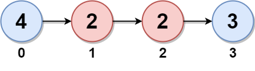
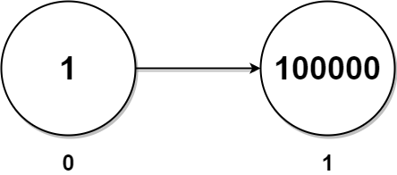

## 2130. Maximum Twin Sum of a Linked List (Medium)
**Date and Time:** Oct 27, 2024, 21:16 (EST)

Link: https://leetcode.com/problems/maximum-twin-sum-of-a-linked-list/

<br>

### Question:
In a linked list of size `n`, where `n` is **even**, the `ith` node (**0-indexed**) of the linked list is known as the **twin** of the `(n-1-i)th` node, if `0 <= i <= (n / 2) - 1`.

* For example, if `n = 4`, then node `0` is the twin of node `3`, and node `1` is the twin of node `2`. These are the only nodes with twins for `n = 4`.

The **twin sum** is defined as the sum of a node and its twin.

Given the `head` of a linked list with even length, return the **maximum twin sum** of the linked list.

<br>

**Example 1:**


> **Input:** head = [5,4,2,1]
> 
> **Output:** 6
>
> **Explanation:** <br>
> Nodes 0 and 1 are the twins of nodes 3 and 2, respectively. All have twin sum = 6. <br>
> There are no other nodes with twins in the linked list. <br>
> Thus, the maximum twin sum of the linked list is 6. 

**Example 2:**



> **Input:** head = [4,2,2,3]
> 
> **Output:** 7
>
> **Explanation:** <br>
> The nodes with twins present in this linked list are: <br>
> \- Node 0 is the twin of node 3 having a twin sum of 4 + 3 = 7. <br>
> \- Node 1 is the twin of node 2 having a twin sum of 2 + 2 = 4. <br>
> Thus, the maximum twin sum of the linked list is max(7, 4) = 7.

**Example 3:**



> **Input:** head = [1,100000]
> 
> **Output:** 100001
>
> **Explanation:** <br>
> There is only one node with a twin in the linked list having twin sum of 1 + 100000 = 100001.

<br>

#### Constraints:
* The number of nodes in the list is an **even** integer in the range `[2, 10^5]`.

* `1 <= Node.val <= 10^5`

<br>

### Walk-through: 
1. Find the middle point by using fast-slow method. While we are traversing `head`, reverse the first half linked-list.

2. Update `res` with the first half reversed linked-list value + second half linked list value.

<br>

### Python Solution:
```python
# Definition for singly-linked list.
# class ListNode:
#     def __init__(self, val=0, next=None):
#         self.val = val
#         self.next = next
class Solution:
    def pairSum(self, head: Optional[ListNode]) -> int:
        # use (n-1-i) to find the twin node for ith node
        # Symmetric from the middle node to form pairs

        # Run fast-slow method to find the middle node
        # Reverse the first half linked-list while traversing head
        # form pairs for these two linked-lists

        # [5,4,2,1]: [4,5], [2,1]
        # [5,4,2,1,2,3,4,5]: [1,2,4,5], [2,3,4,5]

        # TC: O(n), SC: O(1)
        slow = fast = head
        prev = None
        # Running fast-slow method
        while fast:
            fast = fast.next.next
            # Reverse the first half linked-list
            tmp = slow.next
            slow.next = prev
            prev = slow
            slow = tmp

        # prev is reversed linked list, slow is the second half
        res = 0
        while slow:
            res = max(res, slow.val + prev.val)
            prev = prev.next
            slow = slow.next
        
        return res
```
**Time Complexity:** $O(n)$ <br>
**Space Complexity:** $O(1)$

<br>

