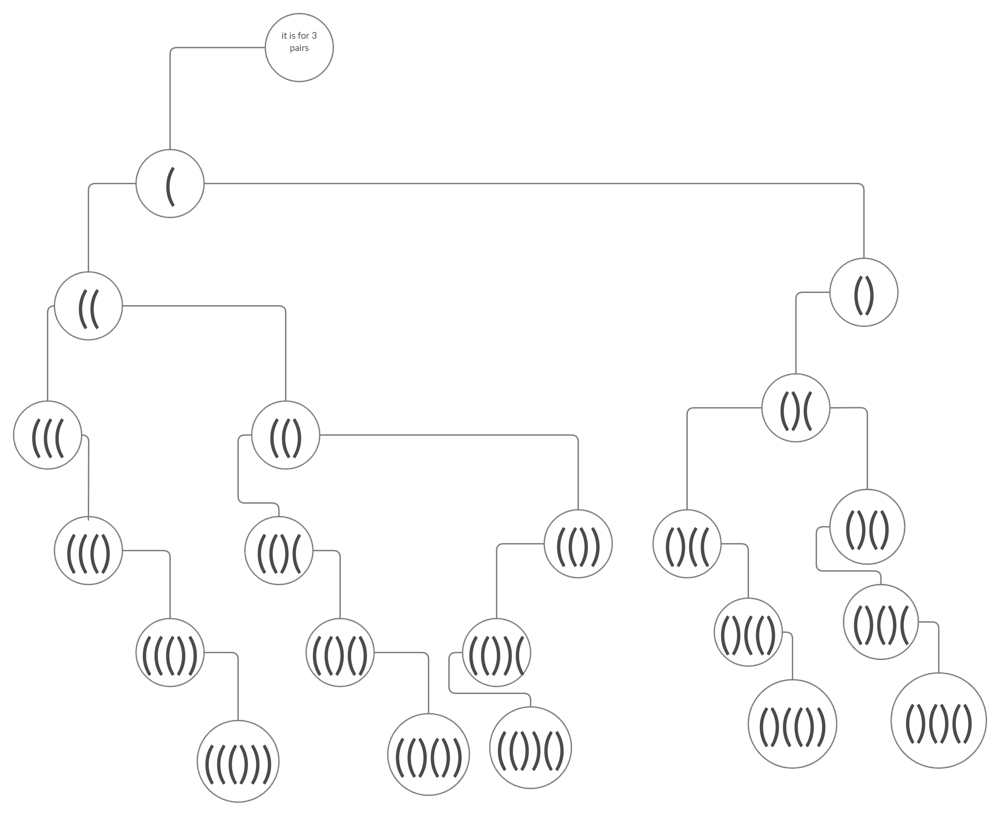

## 22. Generate Parentheses (Medium)
**Date and Time:** Jul 15, 2024, 19:57 (EST)

Link: https://leetcode.com/problems/generate-parentheses/

<br>

### Question:
Given `n` pairs of parentheses, write a function to _generate all combinations of well-formed parentheses_.

<br>

**Example 1:**
> **Input:** n = 3
> 
> **Output:** ["((()))", "(()())", "(())()", "()(())", "()()()"]

**Example 2:**
> **Input:** n = 1
> 
> **Output:** ["()"]

<br>

#### Constraints:
* `1 <= n <= 8`

<br>

### KeyPoints: 
We can use backtracking to append parentheses by checking only three conditions: 1. if `opening == closing == n`, we can append the result into `res[]` and `return`. 2. if `opening < n`, that means we can append `(` to `stack`, because we have restriction on open parenthese `(` that it can only have `n` open parentheses. 3. if `closing < opening` that means we can append close parenthese to `stack[]`, because we have restriction on the number of closing parenthese must be less than the number of open parenthese.



<br>

### My Solution:
```python
class Solution:
    def generateParenthesis(self, n: int) -> List[str]:
        res, stack = [], []
        # 1. opening = closing = n. return
        # 2. opening < n.
        # 3. closing < opening
        def backtracking(opening, closing):
            if opening == closing == n:
                res.append("".join(stack))
                return
            if opening < n:
                stack.append("(")
                backtracking(opening+1, closing)
                stack.pop()
            if closing < opening:
                stack.append(")")
                backtracking(opening, closing+1)
                stack.pop()
        backtracking(0, 0)
        return res
```

<br>

