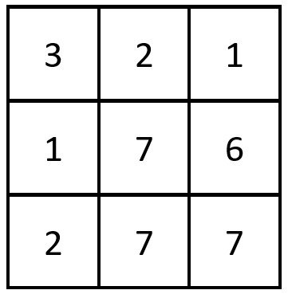

## 2352. Equal Row and Column Pairs (Medium)
**Date and Time:** Oct 21, 2024, 23:27 (EST)

Link: https://leetcode.com/problems/equal-row-and-column-pairs/

<br>

### Question:
Given a **0-indexed** `n x n` integer matrix `grid`, return the number of pairs `(r_i, c_j)` such that row `r_i` and column `c_j` are equal.

A row and column pair is considered equal if they contain the same elements in the same order (i.e., an equal array).

<br>

**Example 1:**



> **Input:** grid = [[3,2,1],[1,7,6],[2,7,7]]
> 
> **Output:** 1
>
> **Explanation:** There is 1 equal row and column pair: <br>
> \- (Row 2, Column 1): [2,7,7]

**Example 2:**


> **Input:** grid = [[3,1,2,2],[1,4,4,5],[2,4,2,2],[2,4,2,2]]
> 
> **Output:** 3
>
> **Explanation:** There are 3 equal row and column pairs: <br>
> \- (Row 0, Column 0): [3,1,2,2] <br>
> \- (Row 2, Column 2): [2,4,2,2] <br>
> \- (Row 3, Column 2): [2,4,2,2]

<br>

#### Constraints:
* `n == grid.length == grid[i].length`

* `1 <= n <= 200`

* `1 <= grid[i][j] <= 10^5`

<br>

### Walk-through: 
Save the converted `str(row)` into `rows{}`. Then we form `str(col)` and find if `str(col)` in `rows{}`. If so, we update `res += rows[str(cols)]`.

<br>

### Python Solution:
```python
class Solution:
    def equalPairs(self, grid: List[List[int]]) -> int:
        # Store every converted row in string into rows{}
        # Form col, and find if str(col) in rows{}, and update res

        # TC: O(n^2), SC: O(n)
        rows = {}  # {row[]: count}
        res = 0
        for r in grid:
            row_str = str(r)
            rows[row_str] = rows.get(row_str, 0) + 1

        for c in range(len(grid[0])):
            col = []
            for r in range(len(grid)):
                col.append(grid[r][c])
            col_str = str(col)
            if col_str in rows:
                res += rows[col_str]

        return res
```
**Time Complexity:** $O(n^2)$, `n` is length of `grid`, and because we loop over the whole grid. <br>
**Space Complexity:** $O(n)$, we save `n` rows in `hashmap{}`, it will hash one row as a entity.

<br>

