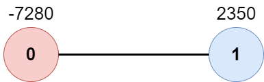

## 2467. Most Profitable Path in a Tree (Medium)
**Date and Time:** Feb 26, 2025, 14:16 (EST)

Link: https://leetcode.com/problems/most-profitable-path-in-a-tree

<br>

### Question:
There is an undirected tree with `n` nodes labeled from `0` to `n - 1`, rooted at node `0`. You are given a 2D integer array `edges` of length `n - 1` where `edges[i] = [a_i, b_i]` indicates that there is an edge between nodes `a_i` and `b_i` in the tree.

At every node `i`, there is a gate. You are also given an array of even integers `amount`, where `amount[i]` represents:

* the price needed to open the gate at node `i`, if `amount[i]` is negative, or,

* the cash reward obtained on opening the gate at node `i`, otherwise.

The game goes on as follows:

* Initially, Alice is at node 0 and Bob is at node bob.

* At every second, Alice and Bob **each** move to an adjacent node. Alice moves towards some **leaf node**, while Bob moves towards node 0.

* For **every** node along their path, Alice and Bob either spend money to open the gate at that node, or accept the reward. Note that:

    * If the gate is **already open**, no price will be required, nor will there be any cash reward.

    * If Alice and Bob reach the node **simultaneously**, they share the price/reward for opening the gate there. In other words, if the price to open the gate is `c`, then both Alice and Bob pay `c / 2` each. Similarly, if the reward at the gate is c, both of them receive `c / 2` each.

* If Alice reaches a leaf node, she stops moving. Similarly, if Bob reaches node 0, he stops moving. Note that these events are **independent** of each other.

Return the **maximum** net income Alice can have if she travels towards the optimal leaf node.

<br>

**Example 1:**


> **Input:** edges = [[0,1],[1,2],[1,3],[3,4]], bob = 3, amount = [-2,4,2,-4,6]
>
> **Output:** 6
>
> **Explanation:** <br>
```
The above diagram represents the given tree. The game goes as follows:
- Alice is initially on node 0, Bob on node 3. They open the gates of their respective nodes.
  Alice's net income is now -2.
- Both Alice and Bob move to node 1. 
  Since they reach here simultaneously, they open the gate together and share the reward.
  Alice's net income becomes -2 + (4 / 2) = 0.
- Alice moves on to node 3. Since Bob already opened its gate, Alice's income remains unchanged.
  Bob moves on to node 0, and stops moving.
- Alice moves on to node 4 and opens the gate there. Her net income becomes 0 + 6 = 6.
Now, neither Alice nor Bob can make any further moves, and the game ends.
It is not possible for Alice to get a higher net income.
```

**Example 2:**



> **Input:** edges = [[0,1]], bob = 1, amount = [-7280,2350]
>
> **Output:** -7280
>
> **Explanation:** <br>
> Alice follows the path 0->1 whereas Bob follows the path 1->0. <br>
> Thus, Alice opens the gate at node 0 only. Hence, her net income is -7280. 

<br>

#### Constraints:
* `2 <= n <= 10^5`

* `edges.length == n - 1`

* `edges[i].length == 2`

* `0 <= a_i, b_i < n`

* `a_i != b_i`

* `edges` represents a valid tree.

* `1 <= bob < n`

* `amount.length == n`

* `amount[i]` is an **even** integer in the range `[-10^4, 10^4]`.

<br>

### Walk-through: 
1. First build an undirected graph to connect each node from each edge.

2. Run DFS from `bob` to find the path that bob will take to reach `0` with the time it takes to reach each node. We use `set()` to keep track of the nodes that we visit so far, and `bob_times{}` to keep track of the time we visit each node. <br> However, we need to double check when we reach a leaf node, we need to check if the leaf node is a root `0`, if so, we can return `True`. Otherwise, we will pop all the nodes in this path to this leaf node.

3. Run BFS from `0` to find every leaf node in this graph by using `deque[[node, time, income]]`. We also use `set()` to keep track of nodes visit so far. Everytime we pop an item from `deque[]`, we first update the income we can get from current `node`.
    - First check `node` is in `bob_times`, if so, then check two cases: 
        - i. current `time` alice spends is the same as bob takes `bob_times[node]`, we update `income += amount[i] // 2` (divide the income at `i` by half).
        - ii. If the `time` alice spends is less than bob, that means alice will take all the `income[i]`.
    - Don't forget if a `node` not in `bob_times{}`, we just take all `income` to alice.

After we update `income`, we can now check if current `node` is a leaf node by `len(graph[node]) == 1 and node != 0`. Then, we can update `ans = max(ans, income)`.

<br>

### Python Solution:
```python
class Solution:
    def mostProfitablePath(self, edges: List[List[int]], bob: int, amount: List[int]) -> int:
        # Build undirected graph
        # Run DFS from bob to 0, keep track of the path with time 
        # Run BFS from alice to each leaf node, find the max income
        # TC: O(n), n is total nodes, SC: O(n)

        # Build undirected graph
        graph = collections.defaultdict(list)
        for i, j in edges:
            graph[i].append(j)
            graph[j].append(i)

        # Run DFS on bob to find 0
        bob_visited = set()
        bob_times = {}
        def dfs(node, time):
            bob_visited.add(node)
            bob_times[node] = time
            if node == 0:
                return True
            for nei in graph[node]:
                if nei not in bob_visited:
                    if dfs(nei, time+1):
                        return True
            # Remove nodes on a path to nonzero leaf node
            bob_times.pop(node)
            return False
        dfs(bob, 0)

        # Run BFS from Alice to every leaf node
        visited = set()
        deque = collections.deque([[0, 0, 0]])      # [node, time, income]
        ans = float("-inf")     # Prevent the max income is negative
        while deque:
            node, time, income = deque.popleft()
            visited.add(node)
            # Update income
            # Check if current node in bob's path
            if node in bob_times:
                # If alice arrives before bob, take it all
                if time < bob_times[node]:
                    income += amount[node]
                # If they arrive at the same time, split the reward
                elif time == bob_times[node]:
                    income += amount[node] // 2
            # If current node not in bob's path, alice takes the reward
            else:
                income += amount[node]
            # Check if current node is a leaf node and update ans
            if len(graph[node]) == 1 and node != 0:
                ans = max(ans, income)
            # Explore nodes
            for nei in graph[node]:
                if nei not in visited:
                    deque.append([nei, time+1, income])
        return ans
```
**Time Complexity:** $O(n)$ <br>
**Space Complexity:** $O(n)$

<br>

