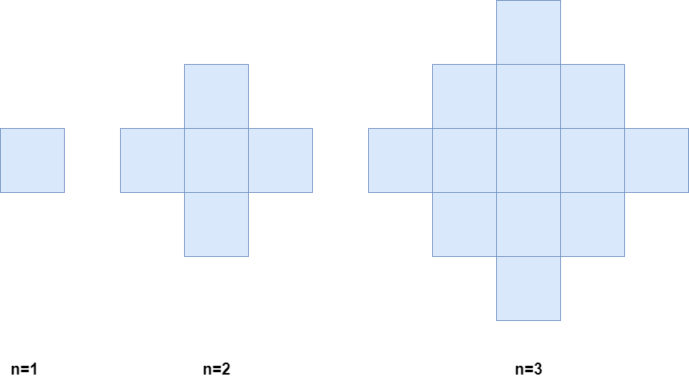

## 2579. Count Total Number of Colored Cells (Medium)
**Date and Time:** Mar 5, 2025, 1:19 (EST)

Link: https://leetcode.com/problems/count-total-number-of-colored-cells

<br>

### Question:
There exists an infinitely large two-dimensional grid of uncolored unit cells. You are given a positive integer `n`, indicating that you must do the following routine for `n` minutes:

* At the first minute, color **any** arbitrary unit cell blue.

* Every minute thereafter, color blue **every** uncolored cell that touches a blue cell.

Below is a pictorial representation of the state of the grid after minutes 1, 2, and 3.



Return the number of **colored cells** at the end of `n` minutes.

<br>

**Example 1:**
> **Input:** n = 1 <br>
> **Output:** 1 <br>
> **Explanation:** After 1 minute, there is only 1 blue cell, so we return 1.

**Example 2:**
> **Input:** n = 2 <br>
> **Output:** 5 <br>
> **Explanation:**  After 2 minutes, there are 4 colored cells on the boundary and 1 in the center, so we return 5. 

<br>

#### Constraints:
* `1 <= n <= 10^5`

<br>

### Walk-through: 
Notice that 
```
# n=1: 0 + 4^0 = 1
# n=2: 1 + 4 * 1 = 5
# n=3: 5 + 4 * 2 = 13
```
We know each `n + 1` is based on the value of `n`, plus the multiple of `4`. Each time we add extra `4` to it. So, just keep track of current value, and the current of `new_cells` we need to add, which contains multiple of `4`.

<br>

### Python Solution:
```python
class Solution:
    def coloredCells(self, n: int) -> int:
        # Each time we add new cells of multiple of 4

        # TC: O(n), SC: O(1)
        new_cells, ans = 0, 1
        while n:
            ans += new_cells
            new_cells += 4
            n -= 1
        return ans
```
**Time Complexity:** $O(n)$ <br>
**Space Complexity:** $O(1)$

<br>

