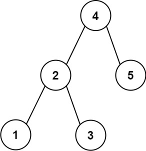
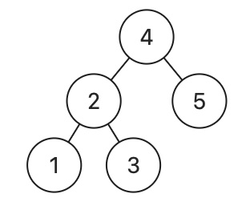

## 270. Closest Binary Search Tree Value (Medium)
**Date and Time:** Dec 15, 2024, 12:44 (EST)

Link: https://leetcode.com/problems/closest-binary-search-tree-value

<br>

### Question:
Given the `root` of a binary search tree and a `target` value, return the value in the BST that is closest to the `target`. If there are multiple answers, print the smallest.

<br>

**Example 1:**



> **Input:** root = [4,2,5,1,3], target = 3.714286
> 
> **Output:** 4

**Example 2:**
> **Input:** root = [1], target = 4.428571
> 
> **Output:** 1

**Edge Case:**



> **Input:** root = [4,2,5,1,3], target = 3.5
> 
> **Output:** 3

<br>

#### Constraints:
* The number of nodes in the tree is in the range `[1, 10^4]`.

* `0 <= Node.val <= 10^9`

* `-10^9 <= target <= 10^9`

<br>

### Python Solution:
```python
# Definition for a binary tree node.
# class TreeNode:
#     def __init__(self, val=0, left=None, right=None):
#         self.val = val
#         self.left = left
#         self.right = right
class Solution:
    def closestValue(self, root: Optional[TreeNode], target: float) -> int:
        # If abs(node.val - target) == abs(res - target), update res = min(node.val, res)
        # If abs(node.val - target) < abs(res - target), update res = node.val
        # Run DFS with Binary Search, if node.val < target: go to the right subtree. If node.val > target: go to the left subtree

        # TC: O(log n), n is total nodes, SC: O(1)
        res = root.val
        def dfs(node):
            nonlocal res
            if not node:
                return
            # Update res base on the difference
            if abs(node.val - target) < abs(res - target):
                res = node.val
            if abs(node.val - target) == abs(res - target):
                res = min(res, node.val)
            # Run DFS with Binary Search
            if node.val < target:
                dfs(node.right)
            else:
                dfs(node.left)
        dfs(root)
        return res
```
**Time Complexity:** $O(log\ n)$ <br>
**Space Complexity:** $O(1)$

<br>

