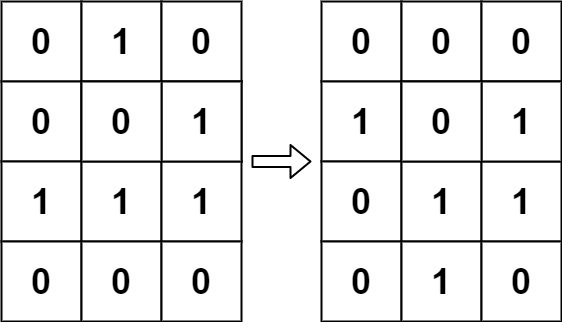

## 289. Game of Life (Medium)
**Date and Time:** Nov 13, 2024, 10:20 (EST)

Link: https://leetcode.com/problems/game-of-life/

<br>

### Question:
According to Wikipedia's article: "The **Game of Life**, also known simply as **Life**, is a cellular automaton devised by the British mathematician John Horton Conway in 1970."

The board is made up of an `m x n` grid of cells, where each cell has an initial state: **live** (represented by a `1`) or **dead** (represented by a `0`). Each cell interacts with its eight neighbors (horizontal, vertical, diagonal) using the following four rules (taken from the above Wikipedia article):

1. Any live cell with fewer than two live neighbors dies as if caused by under-population.

2. Any live cell with two or three live neighbors lives on to the next generation.

3. Any live cell with more than three live neighbors dies, as if by over-population.

4. Any dead cell with exactly three live neighbors becomes a live cell, as if by reproduction.

The next state is created by applying the above rules simultaneously to every cell in the current state, where births and deaths occur simultaneously. Given the current state of the `m x n` grid `board`, return the next state.

<br>

**Example 1:**



> **Input:** board = [[0,1,0],[0,0,1],[1,1,1],[0,0,0]]
> 
> **Output:** [[0,0,0],[1,0,1],[0,1,1],[0,1,0]]

**Example 2:**


> **Input:** board = [[1,1],[1,0]]
> 
> **Output:** [[1,1],[1,1]]

<br>

#### Constraints:
* `m == board.length`

* `n == board[i].length`

* `1 <= m, n <= 25`

* `board[i][j]` is `0` or `1`.

<br>

### Walk-through: 
**Non-optimized Solution:** 
We create a copy of the `board` as a reference. Then, we traverse every entry in the oldBoard and check their `8` neighbors to count how many live cells we have. Then, we update `board[r][c]` according to the number of `live` cells we have and the four rules to update.

**Optimized Solution:**
Very similar to non-optimized solution, we use `-1` to indicate entry that goes from `live` to `dead`. We use `2` to indicate entry that goes from `dead` to `live`. We modify the checking condition that if `abs(board[row][col]) == 1`, we update `live += 1`, and that is also the reason we set it to be `-1`, so the original `live` entry will still be able to found.

After we finished marking live->dead, dead->live, we change `-1` to `0`, `2` to `1`.

<br>

### Extra Space Solution
Remember do `[row.copy() for row in board]` for deep copy, `board.copy()` is shallow copy.
```python
class Solution:
    def gameOfLife(self, board: List[List[int]]) -> None:
        """
        Do not return anything, modify board in-place instead.
        """
        # Copy the original board so we can reference it
        # For every entry, we check their neighbors and count # live cells
        # Update new entry state according to 4 rules

        # TC: O(8 * (m x n)), SC: O(m x n)
        rows, cols = len(board), len(board[0])
        oldBoard = [row.copy() for row in board]
        neighbors = [[-1, 0], [1, 0], [0, 1], [0, -1], [1, -1], [-1, 1], [1, 1], [-1, -1]]
        for r in range(rows):
            for c in range(cols):
                # Checking live cells
                live = 0
                # Traverse 8 neighbors and update live with valid pos
                for dr, dc in neighbors:
                    row, col = r + dr, c + dc
                    if row in range(rows) and col in range(cols) and oldBoard[row][col] == 1:
                            live += 1
                # Checking four rules and make update
                if oldBoard[r][c] == 1 and (live < 2 or live > 3):
                    board[r][c] = 0
                elif oldBoard[r][c] == 0 and live == 3:
                    board[r][c] = 1
```
**Time Complexity:** $O(m * n)$, for every entry we are checking `8` neighbors, and we have `m * n` entries. <br>
**Space Complexity:** $O(m * n)$, we make the copy of the old board.

<br>

### Optimizied Solution
Temporary mark new `0` as `-1`, new `1` as `2`, so we can still count original `1` from taking `abs(-1)`, and not counting new `1` by setting as `2`.
```python
class Solution:
    def gameOfLife(self, board: List[List[int]]) -> None:
        """
        Do not return anything, modify board in-place instead.
        """
        # Q: Two states 1, 0
        # State for 1: i. if neighbors of 1s < two: 1 -> 0. ii. if neis of 1s == 2 or 3: 1 -> 1. iii. neis of 1s > 3: 1 -> 0.
        # State for 0: if neis of 1s == 3: 0 -> 1
        # S: mark entry from 1 -> 0 as -1, entry from 0 -> 1 as 2. So we can still count old 1 as 1, and don't count new 1 as 1.
        # TC: O(mxn), SC: O(1)

        directions = [[-1, 0], [1, 0], [0, 1], [0, -1], [1, 1], [1, -1], [-1, 1], [-1, -1]]
        # Loop over board
        for r in range(len(board)):
            for c in range(len(board[0])):
                # Check neighbors
                lives = 0
                for dr, dc in directions:
                    newR, newC = r+dr, c+dc
                    if newR in range(len(board)) and newC in range(len(board[0])):
                        if abs(board[newR][newC]) == 1:
                            lives += 1
                # Decide if we need to change the original state
                if board[r][c] == 1:
                    if lives < 2 or lives > 3:
                        # Mark as -1 when 1 -> 0, so we can recover it for other entries
                        board[r][c] = -1
                else:
                    if lives == 3:
                        # Mark 0 -> 1 as 2, so we don't count new 1 for other entries
                        board[r][c] = 2
        # Loop over board again to change back -1 -> 0, 2 -> 1
        for r in range(len(board)):
            for c in range(len(board[0])):
                if board[r][c] == -1:
                    board[r][c] = 0
                elif board[r][c] == 2:
                    board[r][c] = 1
```
**Time Complexity:** $O(m * n)$ <br>
**Space Complexity:** $O(1)$, since we are modifying in-place, no extra space needed.

<br>

