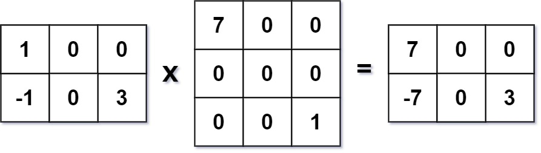

## 311. Sparse Matrix Multiplication (Medium)
**Date and Time:** Apr 3, 2025

Link: https://leetcode.com/problems/sparse-matrix-multiplication

<br>

### Question:
Given two sparse matrices `mat1` of size `m x k` and `mat2` of size `k x n`, return the result of `mat1 x mat2`. You may assume that multiplication is always possible.

<br>

**Example 1:**



> **Input:** mat1 = [[1,0,0],[-1,0,3]], mat2 = [[7,0,0],[0,0,0],[0,0,1]] <br>
> **Output:** [[7,0,0],[-7,0,3]] <br>

**Example 2:**
> **Input:** mat1 = [[0]], mat2 = [[0]] <br>
> **Output:** [[0]] <br>

<br>

#### Constraints:
* `m == mat1.length`

* `k == mat1[i].length == mat2.length`

* `n == mat2[i].length`

* `1 <= m, n, k <= 100`

* `-100 <= mat1[i][j], mat2[i][j] <= 100`

<br>

### Walk-through: 


<br>

### Optimized:
```python

```
**Time Complexity:** $O()$ <br>
**Space Complexity:** $O()$

<br>

### Brute Force:
```python
class Solution:
    def multiply(self, mat1: List[List[int]], mat2: List[List[int]]) -> List[List[int]]:
        # mat1 each row * mat2 each col will be the first row in result matrix
        # TC: O(m * n * k), SC: O(m * n)
        rows1, cols1 = len(mat1), len(mat1[0])
        rows2, cols2 = len(mat2), len(mat2[0])
        col_dict = collections.defaultdict(list)
        res = [[0] * cols2 for _ in range(rows1)]
        # Map each col with a list of every row under this col
        for c in range(cols2):
            for r in range(rows2):
                col_dict[c].append(mat2[r][c])
        # Perform multiplication
        for r in range(rows1):
            for c in range(cols2):
                val = 0
                # Perform dot product
                for i in range(len(mat1[r])):
                    val += mat1[r][i] * col_dict[c][i]
                # Update on res[r][c]
                res[r][c] = val
        return res
```
**Time Complexity:** $O(m*n*k)$ <br>
**Space Complexity:** $O(m*n)$

<br>

