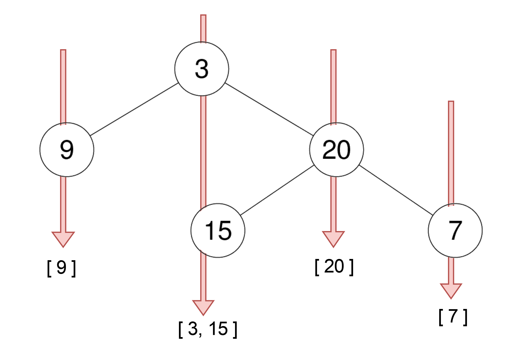
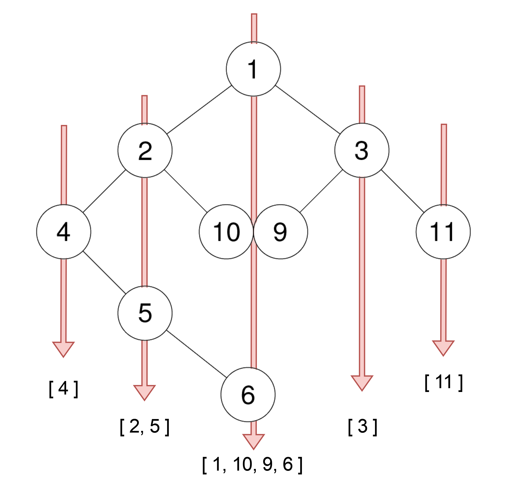
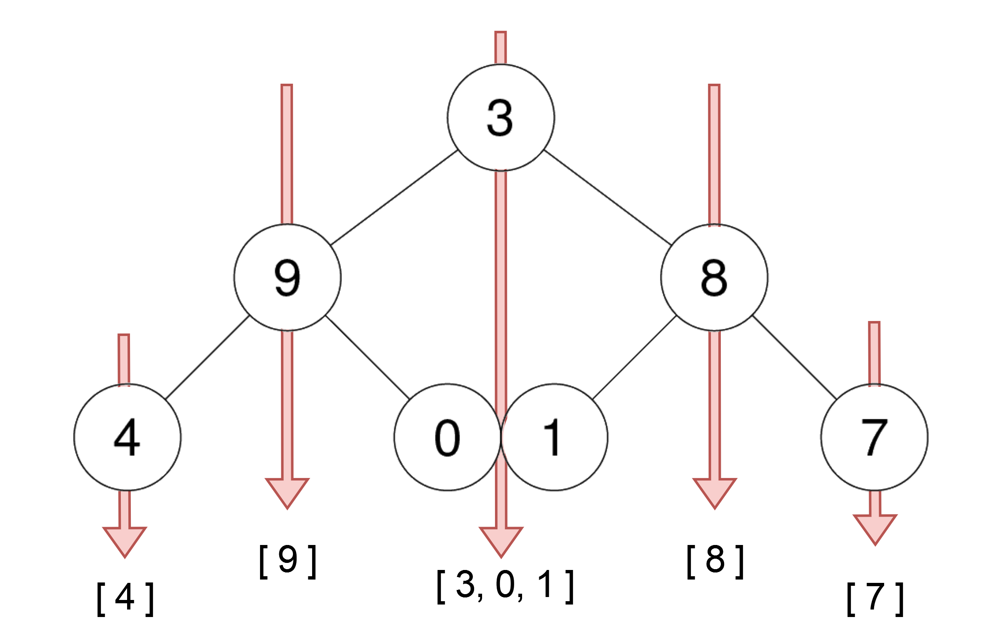

## 314. Binary Tree Vertical Order Traversal (Medium)
**Date and Time:** Nov 26, 2024, 10:40 (EST)

Link: https://leetcode.com/problems/binary-tree-vertical-order-traversal/

<br>

### Question:
Given the `root` of a binary tree, return **the vertical order traversal** of its nodes' values. (i.e., from top to bottom, column by column).

If two nodes are in the same row and column, the order should be from **left to right**.

<br>

**Example 1:**



> **Input:** root = [3,9,20,null,null,15,7]
> 
> **Output:** [[9],[3,15],[20],[7]]

**Example 2:**



> **Input:** root = [3,9,8,4,0,1,7]
> 
> **Output:** [[4],[9],[3,0,1],[8],[7]]

**Example 3:**



> **Input:** root = [1,2,3,4,10,9,11,null,5,null,null,null,null,null,null,null,6]
> 
> **Output:** [[4],[2,5],[1,10,9,6],[3],[11]]

<br>

#### Constraints:
* The number of nodes in the tree is in the range `[0, 100]`.

* `-100 <= Node.val <= 100`

<br>

### Walk-through: 
1. Use deque to save root with its index column `0`, `deque = [(root, 0)]`.

2. We use a `hashmap{col: [node]}` to save all the nodes into a list with the same column index.

3. Lastly, we sort the hashmap keys to append each list into `res[]`.

<br>

### Python Solution:
```python
# Definition for a binary tree node.
# class TreeNode:
#     def __init__(self, val=0, left=None, right=None):
#         self.val = val
#         self.left = left
#         self.right = right
class Solution:
    def verticalOrder(self, root: Optional[TreeNode]) -> List[List[int]]:
        #   3   [0]
        #  1 2  [-1, 1]
        # 4 5   [-2, 0]

        # Run BFS from root with the column [root, 0]
        # Build a dictlist to save all the index with all the nodes
        # Finally, traverse the dictList to append [] into res[]

        # TC: O(n), n is total nodes, SC: O(n)
        deque = collections.deque([(root, 0)])    # [node, col]
        hashmap = collections.defaultdict(list)
        res = []
        # Run BFS to fill out the hashmap
        while deque:
            node, col = deque.popleft()
            # If node is valid, save its index into hashmap
            if node:
                hashmap[col].append(node.val)
                if node.left:
                    deque.append([node.left, col-1])
                if node.right:
                    deque.append([node.right, col+1])

        # Append [] into res[]
        for key in sorted(hashmap.keys()):
            res.append(hashmap[key])
        return res
```
**Time Complexity:** $O(n)$ <br>
**Space Complexity:** $O(n)$

<br>

