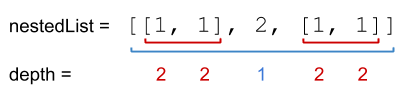

## 339. Nested List Weight Sum (Medium)
**Date and Time:** Nov 29, 2024, 22:50 (EST)

Link: https://leetcode.com/problems/nested-list-weight-sum

<br>

### Question:
You are given a nested list of integers `nestedList`. Each element is either an integer or a list whose elements may also be integers or other lists.

The **depth** of an integer is the number of lists that it is inside of. For example, the nested list `[1,[2,2],[[3],2],1]` has each integer's value set to its **depth**.

Return the sum of each integer in `nestedList` multiplied by its **depth**.

<br>

**Example 1:**



> **Input:** nestedList = [[1,1],2,[1,1]]
> 
> **Output:** 10
>
> **Explanation:** Four 1's at depth 2, one 2 at depth 1. 1*2 + 1*2 + 2*1 + 1*2 + 1*2 = 10.

**Example 2:**


> **Input:** nestedList = [1,[4,[6]]]
> 
> **Output:** 27
>
> **Explanation:** One 1 at depth 1, one 4 at depth 2, and one 6 at depth 3. 1*1 + 4*2 + 6*3 = 27.

**Example 3:**
> **Input:** nestedList = [0]
> 
> **Output:** 0

<br>

#### Constraints:
* `1 <= nestedList.length <= 50`

* The values of the integers in the nested list is in the range `[-100, 100]`.

* The maximum **depth** of any integer is less than or equal to `50`.

<br>

### Walk-through: 
**DFS:**

Run DFS on each element of `nestedList`, we check if this element is integer or list. If this is integer, we update `res += element.val * depth`. Otherwise, we run DFS on element, which is a list to update `res` with each element in that list with `depth + 1`. 

**BFS:**

We use BFS to handle elements level by level, for current level of `depth`, we update `res` with every integer * depth. If there is a list, we `extend()` that list into `deque[]` for next level of depth.

<br>

### DFS Solution:
```python
# """
# This is the interface that allows for creating nested lists.
# You should not implement it, or speculate about its implementation
# """
#class NestedInteger:
#    def __init__(self, value=None):
#        """
#        If value is not specified, initializes an empty list.
#        Otherwise initializes a single integer equal to value.
#        """
#
#    def isInteger(self):
#        """
#        @return True if this NestedInteger holds a single integer, rather than a nested list.
#        :rtype bool
#        """
#
#    def add(self, elem):
#        """
#        Set this NestedInteger to hold a nested list and adds a nested integer elem to it.
#        :rtype void
#        """
#
#    def setInteger(self, value):
#        """
#        Set this NestedInteger to hold a single integer equal to value.
#        :rtype void
#        """
#
#    def getInteger(self):
#        """
#        @return the single integer that this NestedInteger holds, if it holds a single integer
#        Return None if this NestedInteger holds a nested list
#        :rtype int
#        """
#
#    def getList(self):
#        """
#        @return the nested list that this NestedInteger holds, if it holds a nested list
#        Return None if this NestedInteger holds a single integer
#        :rtype List[NestedInteger]
#        """

class Solution:
    def depthSum(self, nestedList: List[NestedInteger]) -> int:
        # Run DFS on nestedList to calculate the sum within the list

        # TC: O(n), n is total digits, SC: O(1)
        def dfs(lst, depth):
            total = 0
            for element in lst:
                # Check if this is integer or list
                if element.isInteger():
                    total += element.getInteger() * depth
                else:
                    total += dfs(element.getList(), depth + 1)
            return total
        return dfs(nestedList, 1)
```
**Time Complexity:** $O(n)$ <br>
**Space Complexity:** $O(1)$

<br>

### BFS Solution:
```python
class Solution:
    def depthSum(self, nestedList: List[NestedInteger]) -> int:
        # Run BFS to handle each level of depth
        # If an element is a list, append the list to deque, handle it on next level of depth
        
        # TC: O(n), n is total elements, SC: O(n)
        deque = collections.deque(nestedList)
        res, depth = 0, 1
        while deque:
            # Handle elements level by level
            for _ in range(len(deque)):
                elem = deque.popleft()
                if elem.isInteger():
                    res += elem.getInteger() * depth
                else:
                    deque.extend(elem.getList())
            depth += 1
        return res
```
**Time Complexity:** $O(n)$ <br>
**Space Complexity:** $O(n)$

<br>

