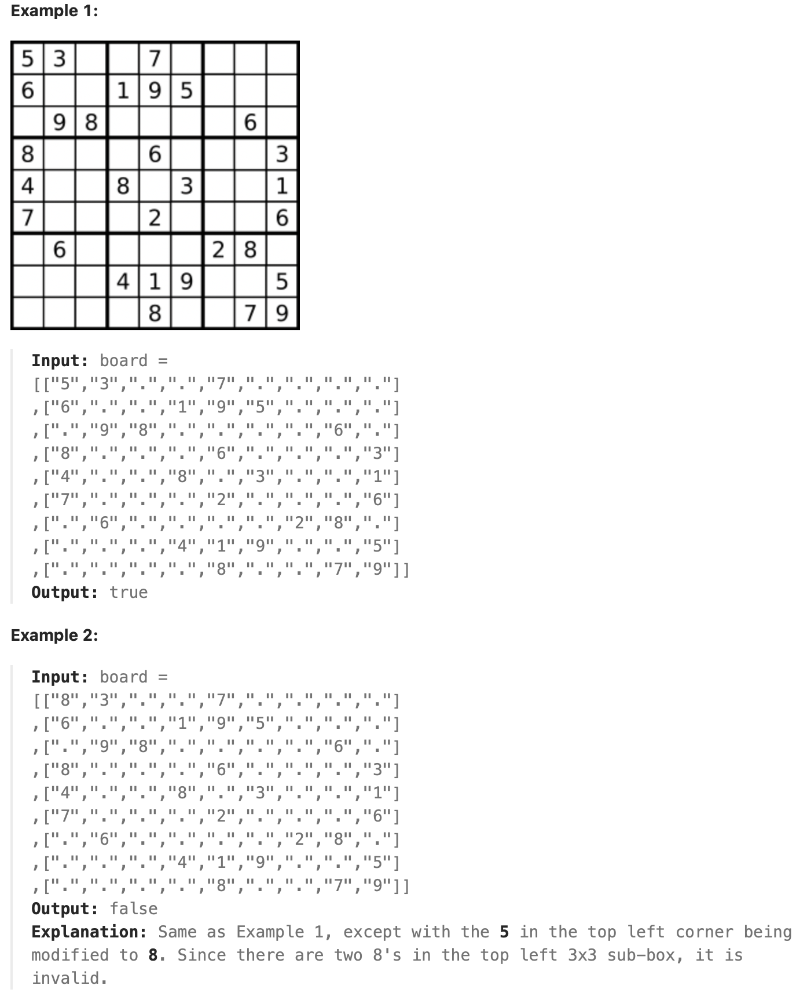
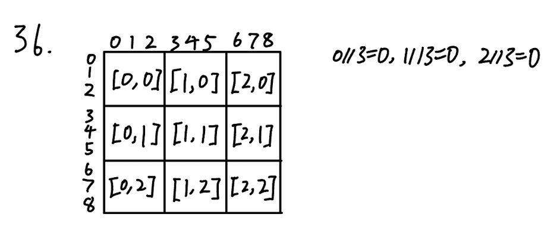

## 36. Valid Sudoku (Medium)
**Update:** Jun 5, 2024, 3:38 PM (EST)

Link: https://leetcode.com/problems/valid-sudoku/

<br>

### Question:
Determine if a `9 x 9` Sudoku board is valid. Only the filled cells need to be validated __according to the following rules:__

1. Each row must contain the digits `1-9` without repetition.

2. Each column must contain the digits `1-9` without repetition.

3. Each of the nine `3 x 3` sub-boxes of the grid must contain the digits `1-9` without repetition.

**Note:**

- A Sudoku board (partially filled) could be valid but is not necessarily solvable.

- Only the filled cells need to be validated according to the mentioned rules.

<br>



### KeyPoints: 
Think about what we do in Neural Network, for this question, we convert each `3 x 3` square into a `1 x 9` array. Then we compare if there is a duplicate by the `set()`. We divided the whole board into nine `3 x 3` sub-boxes by divide each row, col indices by `3`, so the same `3` indices of rows and cols will be group into the same set, then we check if there is a duplicate in the created set().

First create dictionary for rows, cols, and squares, then for each new row, we need to initialize the row with a set in the dictionary, so we can perform `add()` for each row.

```
>>> rows = {}
>>> rows[0] = set()
>>> rows[0].add(1)
>>> rows
    {0: {1}}
```



<br>

### My Solution:
```python
class Solution:
    def isValidSudoku(self, board: List[List[str]]) -> bool:
        rows = {}
        cols = {}
        squares = {}
        for r in range(len(board)):
            rows[r] = set()
            for c in range(len(board)):
                if c not in cols:
                    cols[c] = set()
                if (r // 3, c // 3) not in squares:
                    squares[r//3, c//3] = set()
                val = board[r][c]
                if val == '.':
                    continue
                if val in rows[r] or val in cols[c] or val in squares[r//3, c//3]:
                    return False
                # Add elements into sets if elements not in yet
                rows[r].add(val)
                cols[c].add(val)
                squares[r//3, c//3].add(val)
        return True
```

<br>

