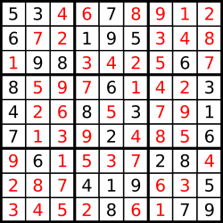

## 37. Sudoku Solver (Medium)
**Date and Time:** Dec 30, 2024, 21:54 (EST)

Link: https://leetcode.com/problems/sudoku-solver

<br>

### Question:
Write a program to solve a Sudoku puzzle by filling the empty cells.

A sudoku solution must satisfy **all of the following rules**:

1. Each of the digits `1-9` must occur exactly once in each row.

2. Each of the digits `1-9` must occur exactly once in each column.

3. Each of the digits `1-9` must occur exactly once in each of the 9 `3x3` sub-boxes of the grid.

The `'.'` character indicates empty cells.

<br>

**Example 1:**


> **Input:** board = [["5","3",".",".","7",".",".",".","."], <br>
> ["6",".",".","1","9","5",".",".","."], <br>
> [".","9","8",".",".",".",".","6","."], <br>
> ["8",".",".",".","6",".",".",".","3"], <br>
> ["4",".",".","8",".","3",".",".","1"], <br>
> ["7",".",".",".","2",".",".",".","6"], <br>
> [".","6",".",".",".",".","2","8","."], <br>
> [".",".",".","4","1","9",".",".","5"], <br>
> [".",".",".",".","8",".",".","7","9"]]
> 
> **Output:** [["5","3","4","6","7","8","9","1","2"], <br>
> ["6","7","2","1","9","5","3","4","8"], <br>
> ["1","9","8","3","4","2","5","6","7"], <br>
> ["8","5","9","7","6","1","4","2","3"], <br>
> ["4","2","6","8","5","3","7","9","1"], <br>
> ["7","1","3","9","2","4","8","5","6"], <br>
> ["9","6","1","5","3","7","2","8","4"], <br>
> ["2","8","7","4","1","9","6","3","5"], <br>
> ["3","4","5","2","8","6","1","7","9"]]
>
> **Explanation:** The input board is shown above and the only valid solution is shown below: <br>
> 

<br>

#### Constraints:
* `board.length == 9`

* `board[i].length == 9`

* `board[i][j]` is a digit or `'.'`.

* It is **guaranteed** that the input board has only one solution.

<br>

### Walk-through: 
Use three sets to save each entry into sets, then we run backtrack on each entry and when entry is `'.'`, we try `i` from `[1, 9]` to find the right one, so we set `board[r][c] = str(i)` and add this entry into three sets. Then, we forward to next column for backtracking, if this is false, we remove this current val and reset it back to `'.'`. 

For the backtrack base cases, we stop backtracking when we reach the last entry in `board`, (`r == n-1 and c == n`), and when we reach `c == n`, we need to increment row `r += 1` and reset `c = 0`. 

<br>

### Python Solution:
```python
class Solution:
    def solveSudoku(self, board: List[List[str]]) -> None:
        """
        Do not return anything, modify board in-place instead.
        """
        # Use three sets to save existed vals, use backtracking to try number from 1 to 9, if it doesn't work out, try a different number that is not in 3 sets

        # TC: O(9!^9), SC: O(9^2)
        rowSet, colSet, boxSet = collections.defaultdict(set), collections.defaultdict(set), collections.defaultdict(set)
        n = len(board)
        # Add existed vals into sets
        for r in range(n):
            for c in range(n):
                if board[r][c] != '.':
                    rowSet[r].add(board[r][c])
                    colSet[c].add(board[r][c])
                    boxSet[(r//3, c//3)].add(board[r][c])
        
        def backtr(r, c):
            # Base cases
            if r == n-1 and c == n:
                return True
            # Move to next row
            if c == n:
                return backtr(r+1, 0)
            # Move forward, don't need backtrack
            if board[r][c] != '.':
                return backtr(r, c+1)
            # backtr i from 1 to 9
            for i in range(1, 10):
                if str(i) in rowSet[r] or str(i) in colSet[c] or str(i) in boxSet[(r//3, c//3)]:
                    continue
                # Set board[r][c] to be str(i) and add to sets
                board[r][c] = str(i)
                rowSet[r].add(str(i))
                colSet[c].add(str(i))
                boxSet[(r//3, c//3)].add(str(i))
                # Check if str(i) is valid
                if backtr(r, c+1):
                    return True
                # Remove str(i) from sets if i is not valid
                board[r][c] = '.'
                rowSet[r].remove(str(i))
                colSet[c].remove(str(i))
                boxSet[(r//3, c//3)].remove(str(i))
            return False
        backtr(0, 0)
```
**Time Complexity:** $O(9!^9)$, for each row we have `9!` choices for the first entry, `8!` choices for the second entry. And we have `9` rows in total. <br>
**Space Complexity:** $O(9^2)$

<br>

