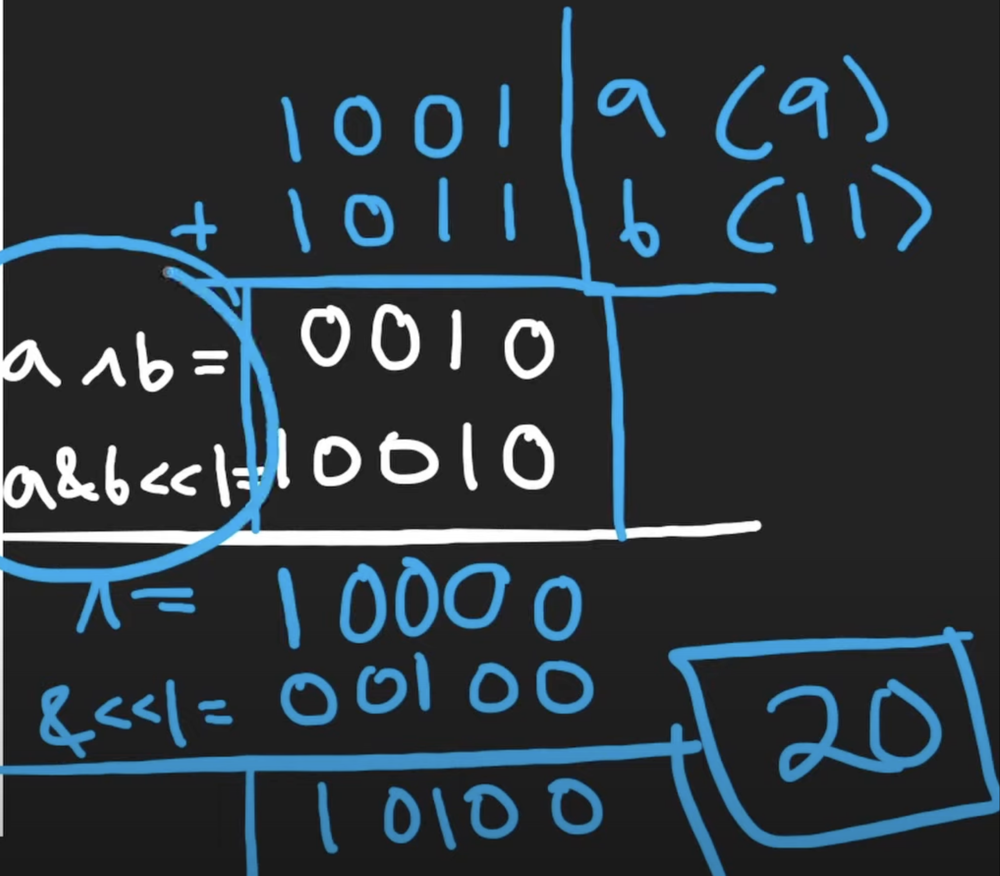

## 371. Sum of Two Integers (Medium)
**Date and Time:** Sep 3, 2024, 17:30 (EST)

Link: https://leetcode.com/problems/sum-of-two-integers/

<br>

### Question:
Given two integers `a` and `b`, return _the sum of the two integers without using the operators_ `+` _and_ `-.`

<br>

**Example 1:**
> **Input:** a = 1, b = 2
> 
> **Output:** 3

**Example 2:**
> **Input:** a = 2, b = 3
> 
> **Output:** 5

<br>

#### Constraints:
* `-1000 <= a, b <= 1000`

<br>

### Walk-through: 
When we want to add two integers together, we can first perform XOR (^), then use AND (&) to get the carry bit and left shift by 1 (because 01 & 01 = 10). We reassign `a = a ^ b`, `b = (a & b) << 1`, we repeat these steps until carry bit is 0 (`b == 0`).



<br>

### Java Solution:
```java
class Solution {
    public int getSum(int a, int b) {
        while (b != 0) {
            int tmp = (a & b) << 1;
            a = a ^ b;
            b = tmp;
        }
        return a;
    }
}
```
**Time Complexity:** $O(n)$, depends how many times we get a carry. <br>
**Space Complexity:** $O(1)$

<br>

