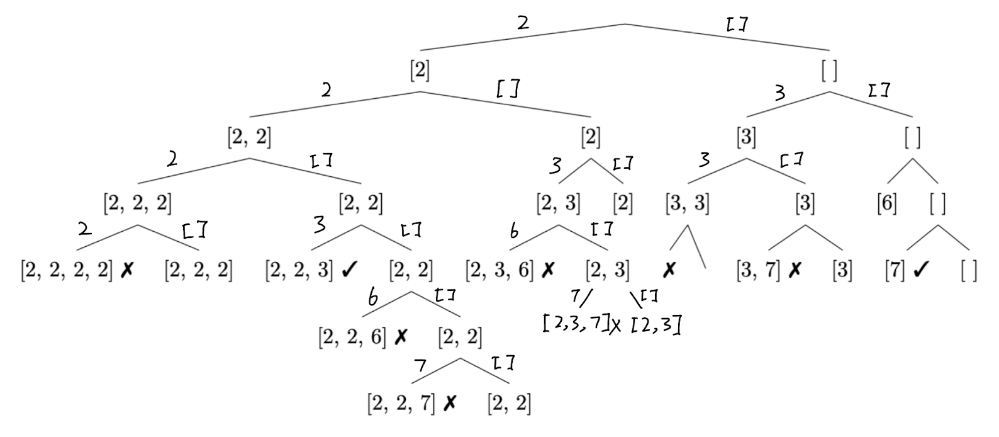

## 39. Combination Sum (Medium)
**Date:** Jun 22, 2024

Link: https://leetcode.com/problems/combination-sum/

<br>

### Question: 
Given an array of **distinct** integers `candidates` and a target integer `target`, return _a list of all **unique combinations**_ of `candidates` _where the chosen numbers sum to_ `target`. You may return the combinations in __any order__.

The **same** number may be chosen from `candidates` an __unlimited number of times__. Two combinations are unique if the frequency of at least one of the chosen numbers is different.

The test cases are generated such that the number of unique combinations that sum up to `target` is less than `150` combinations for the given input.

<br>

**Example 1:**
> **Input:** candidates = [2, 3, 6, 7], target = 7
> 
> **Output:** [[2, 2, 3], [7]]
>
> **Explanation:** <br>
> 2 and 3 are candidates, and 2 + 2 + 3 = 7. Note that 2 can be used multiple times. <br>
> 7 is a candidate, and 7 = 7.

**Example 2:**
> **Input:** candidates = [2, 3, 5], target = 8
> 
> **Output:** [[2, 2, 2, 2], [2, 3, 3], [3, 5]]

**Example 3:**
> **Input:** candidates = [2], target = 1
> 
> **Output:** [ ]

<br>

### KeyPoints: 
Look at the decision tree, we only add the same number to the left subtree, on the right subtree, we will only consider the `candidates[i+1]`, e.g. after the first subtree, we continue adding `2` on the left subtree, but on the right subtree's left subtrees, we only adding `3, 6, 7` each division.

<p align="center">


</p>

Output of the dfs Preorder traversal
```
[]
[2]
[2, 2]
[2, 2, 2]
[2, 2, 2, 2]
[2, 2, 2]
[2, 2, 2, 3]
[2, 2, 2]
[2, 2, 2, 6]
[2, 2, 2]
[2, 2, 2, 7]
[2, 2, 2]
[2, 2]
[2, 2, 3]
[2, 2]
[2, 2, 6]
[2, 2]
[2, 2, 7]
[2, 2]
[2]
[2, 3]
[2, 3, 3]
[2, 3]
[2, 3, 6]
[2, 3]
[2, 3, 7]
[2, 3]
[2]
[2, 6]
[2]
[2, 7]
[2]
[]
[3]
[3, 3]
[3, 3, 3]
[3, 3]
[3, 3, 6]
[3, 3]
[3, 3, 7]
[3, 3]
[3]
[3, 6]
[3]
[3, 7]
[3]
[]
[6]
[6, 6]
[6]
[6, 7]
[6]
[]
[7]
[]
```

<br>

### My Solution:
```python
class Solution:
    def combinationSum(self, candidates: List[int], target: int) -> List[List[int]]:
        # Use the same method for Backtracking, check if sum up to target
        res = []
        curr = []
        total = 0
        def dfs(i, curr, total):
            # Base case: if total == target, append curr to res
            if total == target:
                res.append(curr.copy())
                return
            # Base case 2: if i >= len(candidates) or sum > target, return
            if i >= len(candidates) or total > target:
                return
            curr.append(candidates[i])
            # Left subtree
            # total + candidates[i] because we changed curr with candidates[i]
            dfs(i, curr, total + candidates[i])
            # Right subtree
            # we pop an element from curr, so we only pass in total
            curr.pop()
            dfs(i+1, curr, total)
        dfs(0, curr, total)
        return res
```

<br>

