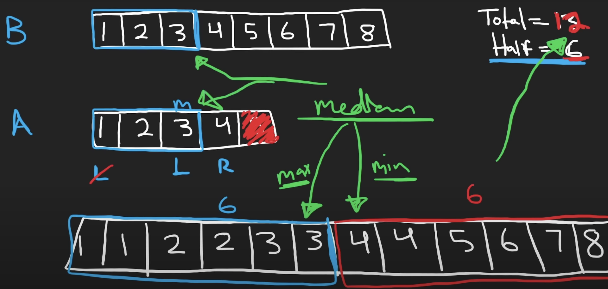
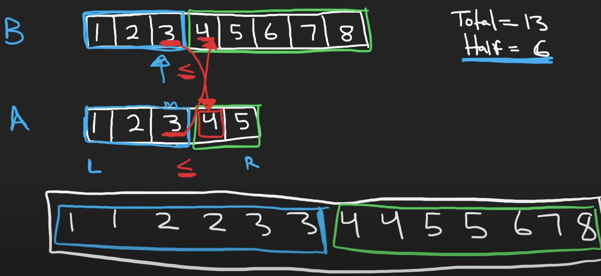
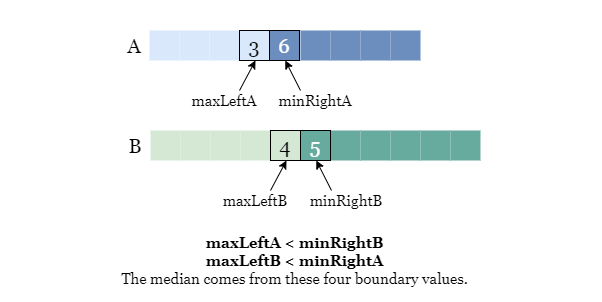

## 4. Median of Two Sorted Arrays (Hard)
**Date and Time:** Jul 22, 2024, 16:41 (EST)

Link: https://leetcode.com/problems/median-of-two-sorted-arrays/

<br>

### Question:
Given two sorted arrays `nums1` and `nums2` of size `m` and `n` respectively, return **the median** of the two sorted arrays.

The overall run time complexity should be `O(log (m+n))`.

<br>

**Example 1:**
> **Input:** nums1 = [1,3], nums2 = [2]
> 
> **Output:** 2.00000
>
> **Explanation:** merged array = [1,2,3] and median is 2.

**Example 2:**
> **Input:** nums1 = [1,2], nums2 = [3,4]
> 
> **Output:** 2.50000
>
> **Explanation:** merged array = [1,2,3,4] and median is (2 + 3) / 2 = 2.5.

<br>

#### Constraints:
* `nums1.length == m`

* `nums2.length == n`

* `0 <= m <= 1000`

* `0 <= n <= 1000`

* `1 <= m + n <= 2000`

* `-10^6 <= nums1[i], nums2[i] <= 10^6`

<br>

### KeyPoints: 
If we merge all two arrays together, we will get `[1, 1, 3, 4, 5], nums1 = [1, 3], nums2 = [1, 4, 5]`, it is same for us to just find the middle two elements (for even total length) or just the middle element (for odd total length) and we can find the median of the two arrays.

And the way we know we find the right two elements from two separate nums is that, for each `nums` we separate them into `left_partition` and `right_parition`, so elements we find from these two separate `left_parition` should all be less or equal to the another nums first element in `right_partition`.

<center>

<p> Total length is odd </p>
</center>

<br>

For example, `A = [1, 2, 3, 4], B = [1, 2, 3, 4, 5, 6, 7, 8], merged = [1, 1, 2, 2, 3, 3, 4, 4, 5, 6, 7, 8]`, we first find the left partition of `A` to be `[1, 2, 3]`, `B` will be `[1, 2, 3]`, now the `ALeft, ARight = 3, 4`, `BLeft, BRight = 3, 4`, we find the `BLeft < Aright and BLeft < Bright`, same for `Aleft <= BRight and ALeft <= ARight`, so we can confirm that the elements we find are in correct partition. Then, we just need to find the `max(ALeft, BLeft)` from the left partition, and the `min(ARight, BRight)` from the right partition, and `return (min(Aright, Bright) + max(Aleft, Bleft)) / 2`. 

<br>

<center>

<p> Total length is even </p>
</center>

Otherwise, if the total length is odd, we just return `min(Aright, Bright)`.

<br>

### Walk-through:
1. Set the shorter array `nums1` or `nums2` as "pivot" to be `A`, so we can find `l = 0, r = len(A)-1`, hence we can find the median of `A` (shorter array) to be `(l+r) // 2`. Then, we find `half = total // 2`, so the median `j` for `B` is `j = half - i - 2`. <br> <br> **Note:** if we run binary search on the longer array, and we use `half - i - 2` to find `j`, if `B` is very short, we may be out of index.

2. According to the two medians for `nums1, nums2`, we can find `Aleft, Aright, Bleft, Bright` to know if we find the correct median for these two arrays. Because the correct medians should have the following relationship: `Aleft <= Bright and Bleft <= Aright`.

<center>

</center>

If `Aleft` is out of bound (`i < 0`), we set `Aleft = float("-inf")`. If `Aright` is out of bound (`i > len(A)-1`), we set `Aright = float("inf")`. Same thing for `Bleft, Bright`, just change `i` to be `j`.

3. Lastly, if `Aleft <= Bright and Bleft <= Aright` is not True. We need to adjust `i` ptr, if `Aleft > Bright`, that means we need to search the left part of `Aleft`, so we update `r = i - 1`. Otherwise `Bleft > Aright`, means `i` is too small, so we need to search the right part of `i`, we update `l = i + 1`.

<br>

### My Solution:
```python
class Solution:
    def findMedianSortedArrays(self, nums1: List[int], nums2: List[int]) -> float:
        # Find the median of two nums merged 
        # [1, 2, 3], [1, 3, 4, 5], merged: [1, 1, 2, 3, 4, 5]
        # Consider two scenarios: even length or odd length
        # Total length of the merged list, and calculate the half length
        # Given the half length, find two pivots from each num
        # Compare to find the right medians from two nums
        # Correct: Everything on the left of the pivot should be less than their right parition for both nums, same as the right partition
        # If total length is odd, return the min(Aleft, Bleft)
        # If total length is even, return (max(Aleft, Bleft) + min(Aright, Bright)) / 2
        
        # TC: O(log m/log n), SC: O(1)
        total = len(nums1) + len(nums2)
        half = total // 2
        A, B = nums1, nums2
        # Exchange A, B depends on length
        if len(A) < len(B):
            A, B = B, A
        l, r = 0, len(A)-1
        while True:
            # Run BS to find the median i of A, use half - i - 2 to find median j of B
            i = (l + r) // 2
            j = half - i -2
            # Check if the index we find are valid for both
            Aleft = A[i] if i >= 0 else float("-inf")
            Aright = A[i+1] if i + 1 < len(A) else float("inf")
            Bleft = B[j] if j >= 0 else float("-inf")
            Bright = B[j+1] if j + 1 < len(B) else float("inf")
            if Aleft <= Bright and Bleft <= Aright:
                if total % 2 == 1:
                    return min(Aright, Bright)
                else:
                    return (max(Aleft, Bleft) + min(Aright, Bright)) / 2
            elif Aleft > Bright:
                r = i - 1
            else:
                l = i + 1
```
**Time Complexity:** $O(log\ n)$, `n` is `len(A)`. Because we only run binary search on  <br>
**Space Complexity:** $O(1)$

<br>

