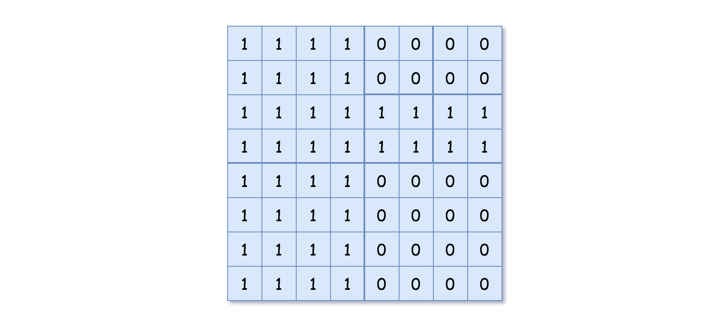

## 427. Construct Quad Tree (Medium)
**Date and Time:** Aug 15, 2024, 21:21 (EST)

Link: https://leetcode.com/problems/construct-quad-tree/

<br>

### Question:
Given a `n * n` matrix `grid` of `0's` and `1's` only. We want to represent `grid` with a Quad-Tree.

Return _the root of the Quad-Tree representing_ `grid`.

A Quad-Tree is a tree data structure in which each internal node has exactly four children. Besides, each node has two attributes:

* `val`: True if the node represents a grid of 1's or False if the node represents a grid of 0's. Notice that you can assign the val to True or False when isLeaf is False, and both are accepted in the answer.

* `isLeaf`: True if the node is a leaf node on the tree or False if the node has four children.
```
class Node {
    public boolean val;
    public boolean isLeaf;
    public Node topLeft;
    public Node topRight;
    public Node bottomLeft;
    public Node bottomRight;
}
```
We can construct a Quad-Tree from a two-dimensional area using the following steps:

1. If the current grid has the same value (i.e all 1's or all 0's) set isLeaf True and set val to the value of the grid and set the four children to Null and stop.
2. If the current grid has different values, set isLeaf to False and set val to any value and divide the current grid into four sub-grids as shown in the photo.
3. Recurse for each of the children with the proper sub-grid.

<center>

</center>

**Quad-Tree format:**

You don't need to read this section for solving the problem. This is only if you want to understand the output format here. The output represents the serialized format of a Quad-Tree using level order traversal, where `null` signifies a path terminator where no node exists below.

It is very similar to the serialization of the binary tree. The only difference is that the node is represented as a list `[isLeaf, val]`.

If the value of `isLeaf` or `val` is True we represent it as 1 in the list `[isLeaf, val]` and if the value of `isLeaf` or `val` is False we represent it as **0**.

<br>

**Example 1:**

<center>

</center>

> **Input:** grid = [[0,1],[1,0]]
> 
> **Output:** [[0,1],[1,0],[1,1],[1,1],[1,0]]
>
> **Explanation:** The explanation of this example is shown below: Notice that 0 represents False and 1 represents True in the photo representing the Quad-Tree.

<center>

</center>

**Example 2:**

<center>

</center>

> **Input:** grid = [[1,1,1,1,0,0,0,0],[1,1,1,1,0,0,0,0],[1,1,1,1,1,1,1,1],[1,1,1,1,1,1,1,1],[1,1,1,1,0,0,0,0],[1,1,1,1,0,0,0,0],[1,1,1,1,0,0,0,0],[1,1,1,1,0,0,0,0]]
> 
> **Output:** [[0,1],[1,1],[0,1],[1,1],[1,0],null,null,null,null,[1,0],[1,0],[1,1],[1,1]]
>
> **Explanation:**  All values in the grid are not the same. We divide the grid into four sub-grids.
> The topLeft, bottomLeft and bottomRight each has the same value. <br>
> The topRight have different values so we divide it into 4 sub-grids where each has the same value. <br>
> Explanation is shown in the photo below:

<br>

#### Constraints:
* `n == grid.length == grid[i].length`

* `n == 2^x` where `0 <= x <= 6`

<br>

### Walk-through: 
Looping over all grids to find if they all have the same value, if yes, we return `Node(grid[r][c], True)`; if not, we split them by half (similar to binary search) `n = n // 2`, and we run **dfs** on all four parts `topLeft, topRight, bottomLeft, bottomRight` to return `Node(0, False, topLeft, topRight, bottomLeft, bottomRight)`.

Each square we only use their "grid[0][0]" as root to compare with other grids in its square. In Example 2, we first split the `8 x 8` grid into four `4 x 4` squares, we do that by running **dfs** on `n = n // 2 = 4, topLeft = [0][0], topRight = [0][4], bottomLeft = [4][0], bottomRight = [4][4]`. 

Then for the second split in `topRight`, we have `n = 2, topLeft = [0][4], topRight = [0][6], bottomLeft = [2][4], bottomRight = [2][6]`. Hence, we can conclude the relation to be `n = n // 2, topLeft = [r][c], topRight = [r][c+n], bottomLeft = [r+n][c], bottomRight = [r+n][c+n]`.

In each call on **dfs**, we only run them in each square, after the first split, `dfs(n, r, c)` will only run check in the green zone, then it will return `Node(grid[r][c], True)` as the root for the green `4 x 4` area.

<br>

### Python Solution:
```python
"""
# Definition for a QuadTree node.
class Node:
    def __init__(self, val, isLeaf, topLeft, topRight, bottomLeft, bottomRight):
        self.val = val
        self.isLeaf = isLeaf
        self.topLeft = topLeft
        self.topRight = topRight
        self.bottomLeft = bottomLeft
        self.bottomRight = bottomRight
"""

class Solution:
    def construct(self, grid: List[List[int]]) -> 'Node':
        def dfs(n, r, c):
            allSame = True
            for i in range(n):
                for j in range(n):
                    if grid[r][c] != grid[r+i][c+j]:
                        allSame = False
                        break
            if allSame:
                return Node(grid[r][c], True)
            # When not allSame
            n = n // 2
            topLeft = dfs(n, r, c)
            topRight = dfs(n, r, c+n)
            bottomLeft = dfs(n, r+n, c)
            bottomRight = dfs(n, r+n, c+n)
            return Node(0, False, topLeft, topRight, bottomLeft, bottomRight)
        return dfs(len(grid), 0, 0)
```
**Time Complexity:** $O(n^2 log\ n)$, we run through all the grid, which take $n^2$, the times we to take the split is $log\ n$ times, because this is a binary search. <br>
**Space Complexity:** $O(1)$

<br>

