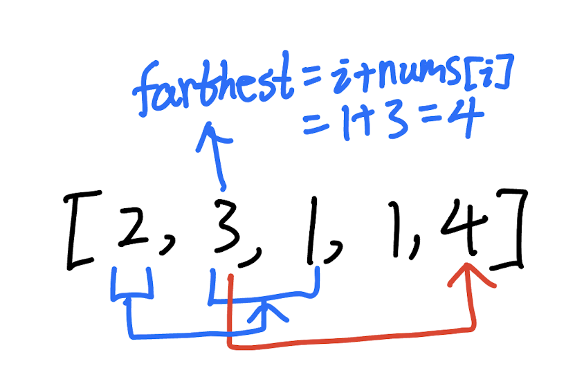

## 45. Jump Game II (Medium)
**Date and Time:** Jul 7, 2024, 14:57 (EST)

Link: https://leetcode.com/problems/jump-game-ii/

<br>

### Question:
You are given a **0-indexed** array of integers `nums` of length `n`. You are initially positioned at `nums[0]`.

Each element `nums[i]` represents the maximum length of a forward jump from index `i`. In other words, if you are at `nums[i]`, you can jump to any `nums[i + j]` where:
* `0 <= j <= nums[i]` and

* `i + j < n`
Return _the minimum number of jumps to reach_ `nums[n - 1]`. The test cases are generated such that you can reach `nums[n - 1]`.

<br>

**Example 1:**
> **Input:** nums = [2, 3, 1, 1, 4]
> 
> **Output:** 2
>
> **Explanation:** The minimum number of jumps to reach the last index is 2. Jump 1 step from index 0 to 1, then 3 steps to the last index.

**Example 2:**
> **Input:** nums = [2, 3, 0, 1, 4]
> 
> **Output:** 2

<br>

#### Constraints:
* `1 <= nums.length <= 10^4`

* `0 <= nums[i] <= 1000`

* It's guaranteed that you can reach `nums[n - 1]`.

<br>

### KeyPoints: 
We are repeatly select the max range from `[l, r]`, then reassign `l = r+1, r = farthest`, and in the next for loop, we select the max range from `[l, r]`.

Minimum number of jumps is the same as finding the maximum steps of each jump. So, we use `l, r` to find a range of number and use it to update the `l, r` ptr, each time we increment the `res` to increment the number of jumps; if `r >= len(nums)`, we stop the while loop.

In **Example 1**, we first check `[2]` at index `0`, and we know we can only check the index `1` and index `2` element from index `0`, so we find the `farthest` from index `1` [3] and index `2` [1], then we know `farthest = 1 + 3 = 4` at index `1`, and we know `r = 4` is equal to `len(nums) - 1`, which breaks the while loop.

<center>

</center>

<br>

### My Solution:
```python
class Solution:
    def jump(self, nums: List[int]) -> int:
        # Use, l, r to keep maintain a window range
        # Update farthest within the range, max(farthest, i + nums[i])
        # Update r to be the farthest, l = r + 1

        # [2, 3, 1, 1, 4]
        # [0, 1, 2, 3, 4]

        # TC: O(n), n = len(nums), SC: O(1)
        l, r = 0, 0
        farthest = 0
        res = 0
        while r < len(nums) - 1:
            # Update res within the current reachable range
            for i in range(l, r + 1):
                farthest = max(farthest, i + nums[i])
            l = r + 1
            r = farthest
            res += 1
        return res
```
**Time Complexity:** $O(n)$ <br>
**Space Complexity:** $O(1)$

<br>

