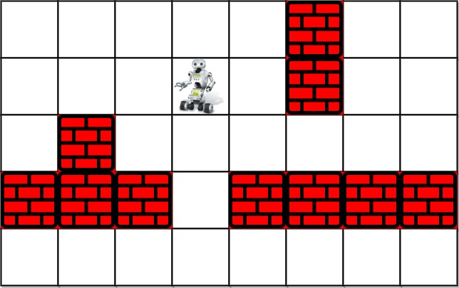

## 489. Robot Room Cleaner (Medium)
**Date and Time:** Jan 25, 2025, 11:00 (EST)

Link: https://leetcode.com/problems/robot-room-cleaner

<br>

### Question:
You are controlling a robot that is located somewhere in a room. The room is modeled as an `m x n` binary grid where `0` represents a wall and `1` represents an empty slot.

The robot starts at an unknown location in the room that is guaranteed to be empty, and you do not have access to the grid, but you can move the robot using the given API `Robot`.

You are tasked to use the robot to clean the entire room (i.e., clean every empty cell in the room). The robot with the four given APIs can move forward, turn left, or turn right. Each turn is `90` degrees.

When the robot tries to move into a wall cell, its bumper sensor detects the obstacle, and it stays on the current cell.

Design an algorithm to clean the entire room using the following APIs:

```
interface Robot {
  // returns true if next cell is open and robot moves into the cell.
  // returns false if next cell is obstacle and robot stays on the current cell.
  boolean move();

  // Robot will stay on the same cell after calling turnLeft/turnRight.
  // Each turn will be 90 degrees.
  void turnLeft();
  void turnRight();

  // Clean the current cell.
  void clean();
}
```

**Note** that the initial direction of the robot will be facing up. You can assume all four edges of the grid are all surrounded by a wall.

<br>

**Example 1:**



> **Input:** room = [[1,1,1,1,1,0,1,1],[1,1,1,1,1,0,1,1],[1,0,1,1,1,1,1,1],[0,0,0,1,0,0,0,0],[1,1,1,1,1,1,1,1]], row = 1, col = 3
> 
> **Output:** Robot cleaned all rooms.
>
> **Explanation:** All grids in the room are marked by either 0 or 1.
0 means the cell is blocked, while 1 means the cell is accessible.
The robot initially starts at the position of row=1, col=3.
From the top left corner, its position is one row below and three columns right.

**Example 2:**
> **Input:** room = [[1]], row = 0, col = 0
> 
> **Output:** Robot cleaned all rooms.

<br>

#### Constraints:
* `m == room.length`

* `n == room[i].length`

* `1 <= m <= 100`

* `1 <= n <= 200`

* `room[i][j]` is either `0` or `1`.

* `0 <= row < m`

* `0 <= col < n`

* `room[row][col] == 1`

* All the empty cells can be visited from the starting position.

<br>

### Walk-through: 
Run DFS from the original position, we first add this current position into `visited()` and `clean()` current position. Then, we check this positions' four directions by calling `move()` and the new position has not been visited and call `backtrack()` later. If so, we call dfs on this new position with current direction. If the new position is not valid, we can rotate our current direction by going right.

`backtr()` will call `turnRight()` two times then we `move()` then `turnRight()` twice again to change back to the original direction.

<br>

### Python Solution:
```python
# """
# This is the robot's control interface.
# You should not implement it, or speculate about its implementation
# """
#class Robot:
#    def move(self):
#        """
#        Returns true if the cell in front is open and robot moves into the cell.
#        Returns false if the cell in front is blocked and robot stays in the current cell.
#        :rtype bool
#        """
#
#    def turnLeft(self):
#        """
#        Robot will stay in the same cell after calling turnLeft/turnRight.
#        Each turn will be 90 degrees.
#        :rtype void
#        """
#
#    def turnRight(self):
#        """
#        Robot will stay in the same cell after calling turnLeft/turnRight.
#        Each turn will be 90 degrees.
#        :rtype void
#        """
#
#    def clean(self):
#        """
#        Clean the current cell.
#        :rtype void
#        """

class Solution:
    def cleanRoom(self, robot):
        """
        :type robot: Robot
        :rtype: None
        """
        # Run DFS on each grid, add to visited() and clean(), then check the new direction's cell if it's available, call on this new pos. Otherwise, try other directions

        # TC: O(4 * (n-m)), n=total grids, m=non-empty grids, SC: O(n-m)
        # Only call backtr() when four directions are invalid
        def backtr():
            robot.turnRight()
            robot.turnRight()
            robot.move()
            robot.turnRight()
            robot.turnRight()
        
        # Keep track of current position with direction
        def dfs(pos, dir):
            visited.add(pos)
            robot.clean()
            # Search four directions and move forward
            for i in range(4):
                # Update direction and pos after the previous rotation
                direct = (dir + i) % 4
                r = pos[0] + directions[direct][0]
                c = pos[1] + directions[direct][1]
                # Check if new pos is not in visited and we can go ahead
                if not (r, c) in visited and robot.move():
                    dfs((r, c), direct)
                    backtr()
                # Otherwise, we should change direction
                robot.turnRight()

        directions = [[-1, 0], [0, 1], [1, 0], [0, -1]]
        visited = set()
        dfs((0, 0), 0)
```
**Time Complexity:** $O(n-m)$, `n` is total grids, `m` is non-empty grids.  <br>
**Space Complexity:** $O(n-m)$

<br>

