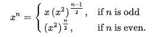

## 50. Pow(x, n) (Medium)
**Date and Time:** Nov 27, 2024, 11:12 (EST)

Link: https://leetcode.com/problems/powx-n

<br>

### Question:
Implement pow(x, n), which calculates `x` raised to the power `n` (i.e., `x^n`).

<br>

**Example 1:**
> **Input:** x = 2.00000, n = 10
> 
> **Output:** 1024.00000

**Example 2:**
> **Input:** x = 2.10000, n = 3
> 
> **Output:** 9.26100

**Example 3:**
> **Input:** x = 2.00000, n = -2
> 
> **Output:** 0.25000
>
> **Explanation:** $2^{-2} = 1/2^2 = 1/4 = 0.25$

**Edge Case:**
> **Input:** x = -1, n = 2147483647
> 
> **Output:** -1

<br>

#### Constraints:
* `-100.0 < x < 100.0`

* $-2^{31} <= n <= 2^{31-1}$

* `n` is an integer.

* Either `x` is not zero or `n > 0`.

* $-10^4 <= x^n <= 10^4$

<br>

### Walk-through: 
1. We can't brute force $O(n)$ time to multiply `x` for `n` times, we need to somehow divide the whole process into half, similar to binary search. So, we can use the pattern to optimze it.

<center>

</center>

2. We then implement a helper function to recursively call it to calculate. We only need two inputs: `base`, `exp`.

3. Finally, check if `n < 0`, so we need to pass in `abs(n)` as `exp`, and return the result with `1 / pow(base, exp)`. 

<br>

### Python Solution:
```python
class Solution:
    def myPow(self, x: float, n: int) -> float:
        # If n is odd, x(x**2)**(n-1/2)
        # If n is even, (x**2)**(n/2)
        # Build a func with (base, exp)

        # TC: O(log n), SC: O(1)
        def pow(base, exp):
            # Base case
            if exp == 0:
                return 1
            # If exp is even
            elif exp % 2 == 0:
                return pow(base * base, exp / 2)
            # If exp is odd
            else:
                return base * pow(base * base, (exp-1) / 2)
        
        return pow(x, n) if n >= 0 else 1 / pow(x, abs(n))
```
**Time Complexity:** $O(log\ n)$, each time we divide the exponent by 2. <br>
**Space Complexity:** $O(1)$

<br>

### Not working Solution:
For the edge case, if we have a huge `n`, it will timeout.
```python
class Solution:
    def myPow(self, x: float, n: int) -> float:
        # When n > 0, repeat n times to multiply x
        # When n = 0, change x = 1 float
        # When n < 0, 1 / n times to multiply x

        # TC: O(n), SC: O(1)
        res = 1
        if n != 0:
            for _ in range(abs(n)):
                res *= x
            if n < 0:
                res = 1 / res
        return res
```
**Time Complexity:** $O(n)$ <br>
**Space Complexity:** $O(1)$

<br>

