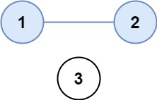

## 547. Number of Provinces (Medium)
**Date and Time:** Aug 12, 2024, 22:05 (EST)

Link: https://leetcode.com/problems/number-of-provinces/

<br>

### Question:
There are `n` cities. Some of them are connected, while some are not. If city `a` is connected directly with city `b`, and city `b` is connected directly with city `c`, then city `a` is connected indirectly with city `c`.

A **province** is a group of directly or indirectly connected cities and no other cities outside of the group.

You are given an `n x n` matrix `isConnected` where `isConnected[i][j] = 1` if the `ith` city and the `jth` city are directly connected, and `isConnected[i][j] = 0` otherwise.

Return _the total number of **provinces**_.

<br>

**Example 1:**



> **Input:** isConnected = [[1,1,0],[1,1,0],[0,0,1]]
> 
> **Output:** 2

**Example 2:**


> **Input:** isConnected = [[1,0,0],[0,1,0],[0,0,1]]
> 
> **Output:** 3

<br>

#### Constraints:
* `1 <= n <= 200`

* `n == isConnected.length`

* `n == isConnected[i].length`

* `isConnected[i][j]` is `1` or `0`.

* `isConnected[i][i] == 1`

* `isConnected[i][j] == isConnected[j][i]`

<br>

### Walk-through: 
First, we need to understand `isConnected`.

We run **dfs** on each `city`, which is just index of `isConnected`. And we get `isConnected[city]`'s index and value to find out if `value == 1` and `index` have not been visited (avoid duplicate), then we add it to `visited()` and run dfs on that index. By running **dfs** on each city from `isConnected`, we can explore a new province, so we can increment `res` each time in the for loop.

The length of `isConnected` is the same as how many nodes we have.

<br>

### Python Solution:
```python
class Solution:
    def findCircleNum(self, isConnected: List[List[int]]) -> int:
        visited = set()
        res = 0
        def dfs(city):
            for neighbor, connected in enumerate(isConnected[city]):
                if connected == 1 and neighbor not in visited:
                    visited.add(neighbor)
                    dfs(neighbor)

        for city in range(len(isConnected)):
            if city not in visited:
                dfs(city)
                visited.add(city)
                res += 1
        return res
```
**Time Complexity:** $O(n^2)$, `n` is the number of cities and also `n` is the `isConnected.length`. <br>
**Space Complexity:** $O(n)$, we store `n` cities in the worst case, because there is no duplication.

<br>

